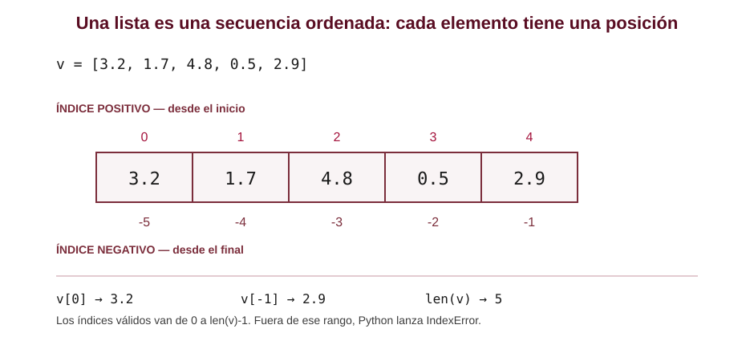
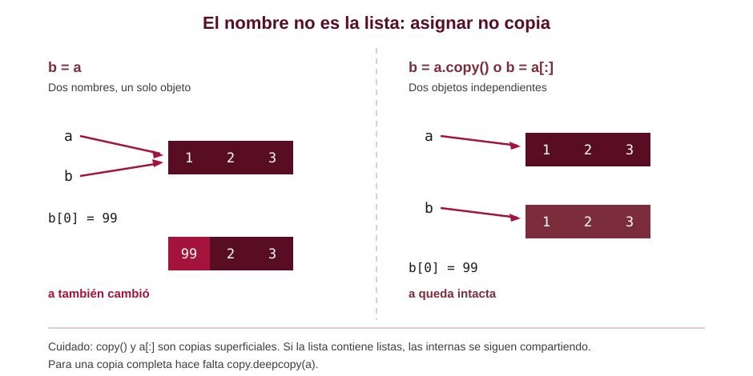
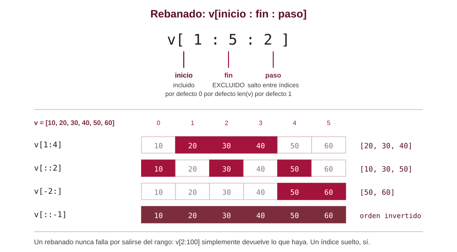
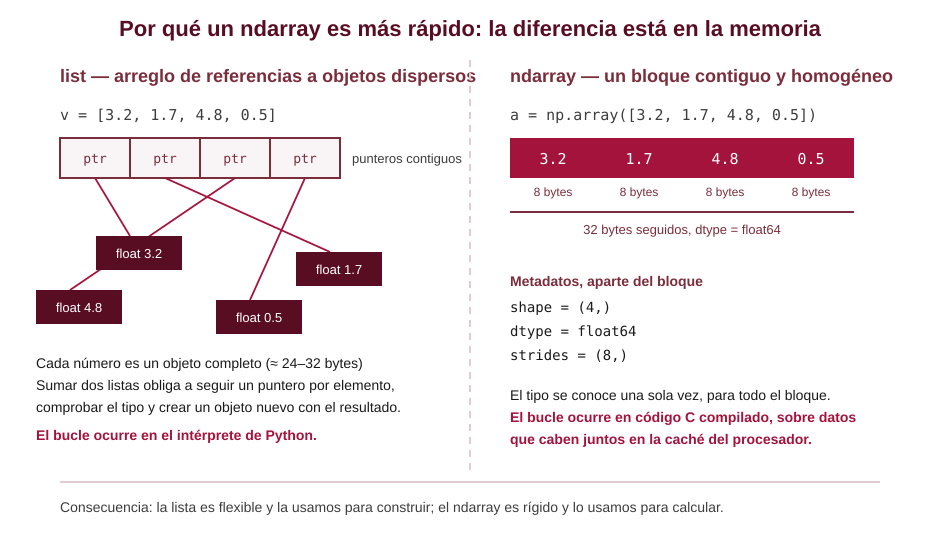
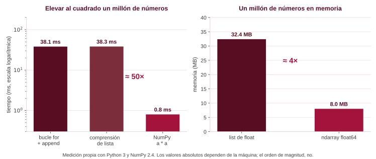
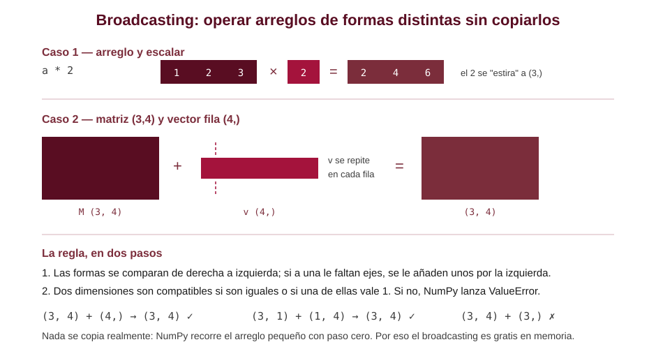
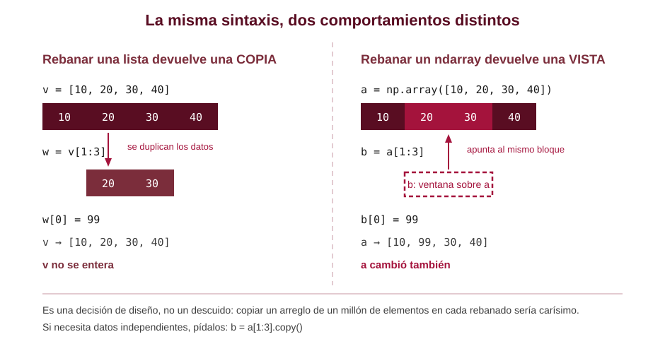
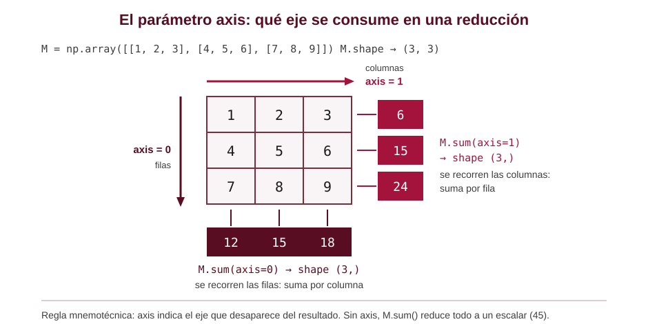

<!-- _class: portada -->

# Listas y arreglos en Python

## De la lista nativa a NumPy, para computación científica

Sergio Augusto Gélvez Cortés
Escuela de Ingeniería de Sistemas e Informática
Universidad Industrial de Santander

Programación orientada a la computación científica

<!--
Sesión dirigida a estudiantes de física. La meta no es memorizar métodos, sino
que entiendan dos cosas: que una lista es un contenedor de referencias, y que
un ndarray es un bloque de memoria tipado. Casi todo lo demás se deduce de ahí.
-->

---

# Mapa de la sesión

1. **La lista de Python** — qué es, cómo se crea, cómo se recorre
2. **Operaciones básicas** — consultar y modificar
3. **Alias y copias** — el error más costoso del semestre
4. **Rebanado** — la sintaxis que después reutilizaremos en NumPy
5. **Listas anidadas** — matrices con listas, y por qué incomodan
6. **NumPy y el ndarray** — qué cambia en la memoria
7. **Vectorización, broadcasting y reducciones**
8. **Comparación y criterio** — cuándo usar cada uno

<!--
Anunciar desde el principio que la sección de listas no es un rodeo: la
sintaxis de rebanado y de recorrido se hereda casi íntegra en NumPy, y hay
tareas donde la lista sigue siendo la herramienta correcta.
-->

---

<!-- _class: seccion -->

# 1. La lista de Python

Una secuencia ordenada y mutable

---

# ¿Qué es una lista?

Una **lista** es una secuencia **ordenada** de referencias a objetos. Tres propiedades la definen:

* **Ordenada**: cada elemento tiene una posición fija, accesible por índice. No es un conjunto.
* **Mutable**: se puede cambiar su contenido y su longitud después de creada.
* **Heterogénea**: puede contener objetos de tipos distintos, incluso otras listas.

```python
medidas   = [20.1, 20.4, 19.8, 20.0]     # homogénea, por disciplina
mezclada  = [1, "electrón", 3.14, True]  # legal, pero rara vez deseable
vacia     = []
```

<!--
La heterogeneidad es legal pero casi siempre indeseable en cálculo numérico:
si una lista de flotantes tiene un None escondido, el error aparece a mitad
del procesamiento y es difícil de rastrear.
-->

---

# Creación e indexación



<!--
Insistir en que el índice negativo no es una excentricidad: v[-1] es la forma
idiomática de pedir el último elemento, sin calcular len(v)-1.
-->

---

# Operaciones que consultan

No modifican la lista; devuelven un valor nuevo.

```python
v = [3.2, 1.7, 4.8, 0.5, 2.9]

len(v)          # 5      cantidad de elementos
v[2]            # 4.8    acceso por índice
4.8 in v        # True   pertenencia
v.index(4.8)    # 2      posición de la primera aparición
v.count(1.7)    # 1      cuántas veces aparece
min(v), max(v)  # (0.5, 4.8)
sum(v)          # 13.1
sorted(v)       # [0.5, 1.7, 2.9, 3.2, 4.8]   lista NUEVA, v intacta
```

<!--
sum, min y max son funciones incorporadas del lenguaje, no métodos de la lista.
sorted devuelve una lista nueva; v.sort() ordena en el sitio. Confundirlas es
un error clásico.
-->

---

# Operaciones que modifican

Actúan **sobre la lista misma** y devuelven `None`.

| Operación | Efecto |
| --- | --- |
| `v.append(x)` | añade `x` al final |
| `v.extend(otra)` | añade todos los elementos de otra secuencia |
| `v.insert(i, x)` | inserta `x` en la posición `i` |
| `v.pop()` / `v.pop(i)` | extrae y **devuelve** el último, o el de índice `i` |
| `v.remove(x)` | elimina la primera aparición de `x` |
| `del v[i]` | elimina el elemento de índice `i` |
| `v.sort()` | ordena en el sitio |
| `v.reverse()` | invierte en el sitio |
| `v.clear()` | deja la lista vacía |

<!--
pop es la única de la tabla que devuelve algo útil. El resto devuelve None,
y ese es justamente el origen del error de la siguiente diapositiva.
-->

---

# El error que todos cometen una vez

```python
v = [3, 1, 2]

v = v.sort()      # ✗  v ahora vale None
print(v)          #    None

v = [3, 1, 2]
v.sort()          # ✓  v vale [1, 2, 3]
print(v)          #    [1, 2, 3]

w = sorted([3, 1, 2])   # ✓  también válido: w es una lista nueva
```

> Los métodos que modifican en el sitio devuelven `None`. Asignar su resultado destruye la lista.

Lo mismo aplica a `append`, `extend`, `insert`, `reverse` y `clear`.

<!--
Vale la pena escribirlo en el tablero y dejarlo un minuto. Es el error que más
tiempo hace perder en los primeros talleres, y el mensaje de Python
("NoneType object is not subscriptable") no señala la causa.
-->

---

# Concatenar y repetir

```python
a = [1, 2]
b = [3, 4]

a + b        # [1, 2, 3, 4]      lista nueva
a * 3        # [1, 2, 1, 2, 1, 2] lista nueva
a += b       # equivale a a.extend(b): modifica a en el sitio
```

**Aviso para más adelante:** en una lista, `+` concatena y `*` repite. En un arreglo de NumPy, `+` suma elemento a elemento y `*` multiplica elemento a elemento. Es la misma sintaxis con dos significados distintos.

<!--
Este contraste conviene sembrarlo ya, porque es la confusión número uno al
pasar de listas a NumPy: [1,2] + [3,4] da [1,2,3,4], pero
np.array([1,2]) + np.array([3,4]) da [4,6].
-->

---

# Asignar no copia



<!--
Aquí conviene mostrar id(a) e id(b) en vivo: son el mismo número en el caso
del alias, distintos en el de la copia. Y mencionar que este comportamiento
es idéntico cuando se pasa una lista a una función: la función recibe el
mismo objeto y puede modificarlo.
-->

---

# Alias, copia superficial y copia profunda

```python
import copy

a = [[1, 2], [3, 4]]

b = a                   # alias: mismo objeto
c = a.copy()            # copia superficial (igual que a[:] o list(a))
d = copy.deepcopy(a)    # copia profunda: replica también las listas internas

c[0][0] = 99            # ¡también cambia a! la lista interna es compartida
d[0][0] = 77            # a no se entera
```

Para el curso: si va a modificar una lista dentro de una función y no quiere efectos colaterales, **copie explícitamente al entrar**.

<!--
La copia superficial copia el arreglo de referencias, no los objetos apuntados.
Con listas de números no se nota, porque los números son inmutables; con
listas de listas, sí. Es exactamente el mismo fenómeno que veremos en NumPy
con vistas y copias.
-->

---

# Rebanado (*slicing*)



<!--
Enfatizar la asimetría: inicio incluido, fin excluido. Es la misma convención
de range() y garantiza que v[:k] + v[k:] reconstruye v para cualquier k.
-->

---

# Rebanado con paso y rebanado como destino

```python
v = [10, 20, 30, 40, 50, 60]

v[1:4]      # [20, 30, 40]
v[::2]      # [10, 30, 50]     uno de cada dos
v[-2:]      # [50, 60]         los dos últimos
v[::-1]     # [60, 50, 40, 30, 20, 10]
v[2:100]    # [30, 40, 50, 60] no falla: recorta al tamaño real

v[1:3] = [0, 0]     # el rebanado también sirve del lado izquierdo
del v[::2]          # y se puede eliminar por rebanado
```

Un rebanado de lista **siempre produce una lista nueva**. Recuérdelo: en NumPy no será así.

<!--
v[:] es el modismo tradicional para copiar una lista completa; hoy se prefiere
v.copy() por claridad. Ambos siguen siendo copias superficiales.
-->

---

# Recorrer una lista

```python
medidas = [20.1, 20.4, 19.8, 20.0]

for x in medidas:                    # lo idiomático: el elemento
    print(x)

for i, x in enumerate(medidas):      # cuando hace falta el índice
    print(f"medida {i}: {x} °C")

for t, y in zip(tiempos, alturas):   # dos secuencias en paralelo
    print(t, y)

for i in range(len(medidas)):        # correcto, pero rara vez necesario
    print(medidas[i])
```

<!--
El último patrón es el que traen quienes vienen de C o Fortran. Funciona,
pero en Python se prefiere iterar sobre el objeto. enumerate y zip son las
dos herramientas que cubren casi todos los casos restantes.
-->

---

# Comprensiones de lista

Construir una lista a partir de otra, en una sola expresión.

```python
t = [0.0, 0.5, 1.0, 1.5, 2.0]

# y = ½ g t²  para cada instante
y = [0.5 * 9.81 * ti**2 for ti in t]

# con filtro
positivos = [x for x in medidas if x > 20.0]

# equivalente explícito de la primera
y = []
for ti in t:
    y.append(0.5 * 9.81 * ti**2)
```

Son más breves y algo más rápidas que el bucle, pero **no** dejan de ser bucles del intérprete.

<!--
Este matiz importa para lo que sigue: la comprensión de lista no es
vectorización. En la medición que veremos, la comprensión y el bucle explícito
tardan prácticamente lo mismo.
-->

---

# Listas anidadas: matrices improvisadas

```python
M = [[1, 2, 3],
     [4, 5, 6],
     [7, 8, 9]]

M[1][2]        # 6      fila 1, columna 2
len(M)         # 3      número de filas
len(M[0])      # 3      número de columnas
[fila[0] for fila in M]    # [1, 4, 7]  primera columna, a mano
```

Con listas, una matriz es una lista de listas: las filas son objetos independientes y **no hay garantía de que tengan la misma longitud**.

<!--
Pedirles que noten lo incómodo que resulta extraer una columna. En NumPy será
M[:, 0]. Esa incomodidad es el mejor argumento para introducir el ndarray.
-->

---

# Una trampa clásica

```python
mal = [[0] * 3] * 3       # ✗
mal[0][0] = 1
# [[1, 0, 0], [1, 0, 0], [1, 0, 0]]   ¡las tres filas son el mismo objeto!

bien = [[0] * 3 for _ in range(3)]    # ✓
bien[0][0] = 1
# [[1, 0, 0], [0, 0, 0], [0, 0, 0]]
```

`* 3` repite **la referencia**, no el contenido. Es el mismo asunto del alias, en otra forma.

<!--
Este error aparece siempre que alguien inicializa una matriz de ceros con
listas. En NumPy se resuelve con np.zeros((3,3)), que además reserva la
memoria de una vez.
-->

---

# Ejercicio guiado: estadísticos de una serie

```python
medidas = [20.1, 20.4, 19.8, 25.6, 20.0, 19.9]   # °C

n     = len(medidas)
media = sum(medidas) / n                          # 20.967

var   = sum((x - media)**2 for x in medidas) / (n - 1)
desv  = var ** 0.5                                # 2.279

mayor = max(medidas)                              # 25.6
pos   = medidas.index(mayor)                      # 3
```

Todo esto funciona y es correcto. La pregunta es qué pasa cuando `medidas` tiene diez millones de elementos y hay que repetirlo mil veces.

<!--
Dejar planteada la pregunta y no responderla todavía. La respuesta es la
segunda mitad de la sesión. El valor 25.6 es un dato atípico deliberado:
lo vamos a filtrar más adelante con una máscara de NumPy.
-->

---

# Ejercicio guiado: producto punto

```python
u = [1.0, 2.0, 3.0]
w = [4.0, 5.0, 6.0]

# versión explícita
punto = 0.0
for i in range(len(u)):
    punto += u[i] * w[i]

# versión idiomática
punto = sum(ui * wi for ui, wi in zip(u, w))      # 32.0
```

Funciona para vectores de cualquier dimensión, pero el bucle lo ejecuta el intérprete, elemento por elemento.

<!--
Buen momento para preguntar cómo escribirían el producto matriz-vector con
listas. Tres bucles anidados y ninguna claridad. Ese es el punto de quiebre.
-->

---

<!-- _class: seccion -->

# 2. NumPy y el ndarray

El arreglo homogéneo de la computación científica

---

# Qué es NumPy

**NumPy** (*Numerical Python*) es la biblioteca sobre la que descansa prácticamente todo el cómputo numérico en Python: SciPy, Matplotlib, pandas, scikit-learn, Astropy y las bibliotecas de análisis de datos experimentales.

Aporta un tipo de dato: el **ndarray**, un arreglo **n-dimensional, homogéneo y de tamaño fijo**.

```python
import numpy as np        # la convención universal; úsela siempre así

a = np.array([3.2, 1.7, 4.8, 0.5])
```

Instalación: `pip install numpy` o `conda install numpy`.

<!--
Mencionar que NumPy nació en 2005 de la fusión de Numeric y numarray, obra de
Travis Oliphant, y que hoy es un proyecto con financiación institucional.
Para estudiantes de física, subrayar que Astropy y todo el análisis de datos
de LIGO están construidos sobre ndarray.
-->

---

# La diferencia está en la memoria



<!--
Este es el diagrama central de la sesión. Si entienden esta diapositiva, el
resto de NumPy son detalles de sintaxis: la homogeneidad y la contigüidad
explican la velocidad, el ahorro de memoria, la existencia de dtype y la
rigidez del tamaño fijo.
-->

---

# Cuánto se gana, en números



<!--
Los datos son de una medición propia con N = 1 000 000. Conviene repetirla en
vivo con %timeit en Jupyter delante de ellos: el número exacto cambia con la
máquina, la relación no. Explicar que la ganancia no viene de que NumPy
"sea C", sino de que el bucle completo baja a código compilado una sola vez.
-->

---

# Crear arreglos

```python
np.array([1.0, 2.0, 3.0])       # desde una lista
np.array([[1, 2], [3, 4]])      # desde listas anidadas: 2D

np.zeros((3, 4))                # matriz 3×4 de ceros
np.ones(5)                      # [1. 1. 1. 1. 1.]
np.full((2, 2), 9.81)           # relleno con un valor
np.eye(3)                       # identidad 3×3
np.empty(4)                     # sin inicializar: contiene basura

np.arange(0, 1, 0.25)           # [0.   0.25 0.5  0.75]   fin excluido
np.linspace(0, 1, 5)            # [0.   0.25 0.5  0.75 1. ]  fin incluido
```

Para muestrear un intervalo físico use **`linspace`**: se especifica cuántos puntos, no el paso, y no acumula error de redondeo.

<!--
arange con paso flotante es una fuente conocida de sorpresas: por acumulación
de redondeo puede incluir o excluir el último punto de manera impredecible.
linspace calcula cada punto a partir de los extremos y no tiene ese problema.
-->

---

# Atributos de un arreglo

```python
M = np.array([[1.0, 2.0, 3.0],
              [4.0, 5.0, 6.0]])

M.shape       # (2, 3)     tamaño de cada eje
M.ndim        # 2          número de ejes
M.size        # 6          total de elementos
M.dtype       # float64    tipo de TODOS los elementos
M.itemsize    # 8          bytes por elemento
M.nbytes      # 48         bytes del bloque de datos
```

El `dtype` se fija al crear el arreglo. Se puede pedir explícitamente:

```python
np.array([1, 2, 3], dtype=np.float64)
np.zeros(1000, dtype=np.int32)
```

<!--
Advertir sobre la asignación silenciosa: si a es de dtype int y se le asigna
a[0] = 3.7, NumPy trunca a 3 sin avisar. En trabajo científico conviene crear
los arreglos como float64 desde el principio.
-->

---

# Aritmética vectorizada

Los operadores actúan **elemento a elemento**, sobre todo el arreglo, sin bucle explícito.

```python
a = np.array([1.0, 2.0, 3.0])
b = np.array([4.0, 5.0, 6.0])

a + b         # [5. 7. 9.]
a * b         # [ 4. 10. 18.]    producto elemento a elemento
a ** 2        # [1. 4. 9.]
2 * a + 1     # [3. 5. 7.]
a @ b         # 32.0             producto punto (matmul)

np.sqrt(a)    # funciones universales (ufuncs): sin, cos, exp, log, abs...
np.sin(a)
```

> Una fórmula de física se escribe casi igual que en el papel, y se aplica a todo el conjunto de datos de una vez.

<!--
Contrastar explícitamente con la lista: [1,2] * 2 repite, np.array([1,2]) * 2
duplica los valores. Y recordar que a * b NO es el producto matricial: para
eso está @ o np.matmul.
-->

---

# Broadcasting



<!--
El caso práctico más frecuente en el curso: restar la media de cada columna a
una matriz de datos, M - M.mean(axis=0). Formas (n,k) y (k,) se combinan sin
escribir un solo bucle. Vale la pena hacerlo en vivo.
-->

---

# Indexación y rebanado

La sintaxis de listas se conserva, y se extiende a varios ejes con comas.

```python
a = np.arange(10)          # [0 1 2 ... 9]
a[3]                       # 3
a[2:5]                     # [2 3 4]
a[::-1]                    # invertido

M = np.arange(1, 10).reshape(3, 3)

M[1, 2]        # 6      fila 1, columna 2   (no M[1][2])
M[0]           # [1 2 3]     primera fila
M[:, 0]        # [1 4 7]     primera COLUMNA, en una expresión
M[0:2, 1:3]    # submatriz
```

Extraer una columna, que con listas exigía una comprensión, aquí es `M[:, 0]`.

<!--
M[1][2] funciona pero crea un arreglo intermedio; M[1, 2] es el modismo
correcto y más eficiente. Con arreglos de más dimensiones la diferencia
se vuelve importante.
-->

---

# Rebanar un arreglo devuelve una vista



<!--
Este es el segundo punto donde se pierden. Aclarar que la vista es una
característica deseada: permite trabajar por bloques sobre arreglos enormes
sin duplicar memoria. Y que .copy() es explícito justamente para que la
copia sea una decisión, no un accidente.
-->

---

# Máscaras booleanas

Comparar un arreglo produce otro arreglo, de booleanos. Ese arreglo sirve para seleccionar.

```python
medidas = np.array([20.1, 20.4, 19.8, 25.6, 20.0, 19.9])

medidas > 20.0            # [ True  True False  True False False]
medidas[medidas > 20.0]   # [20.1 20.4 25.6]

# descartar el dato atípico: dentro de 2 desviaciones estándar
mu, s = medidas.mean(), medidas.std(ddof=1)
buenas = medidas[np.abs(medidas - mu) < 2 * s]
buenas.mean()             # 20.04   (antes era 20.967)

np.sum(medidas > 20.0)    # 3       cuántas cumplen
np.where(medidas > 20.0)  # índices donde se cumple
```

<!--
Este es probablemente el modismo más útil de todo NumPy para un físico:
filtrar datos experimentales por criterio, sin bucles ni condicionales.
Comparar con lo que costaría hacerlo con listas y un if dentro de un for.
-->

---

# Reducciones y el parámetro axis



<!--
Reducciones disponibles: sum, mean, std, var, min, max, argmin, argmax, prod,
any, all, cumsum. Todas aceptan axis. argmin y argmax devuelven el índice,
no el valor: son las que se usan para localizar un pico.
-->

---

# Forma y reorganización

```python
a = np.arange(12)

M = a.reshape(3, 4)      # 3 filas, 4 columnas — es una VISTA de a
M.T                      # transpuesta, (4, 3) — también una vista
a.reshape(-1, 2)         # el -1 significa "calcúlelo usted"
M.ravel()                # de vuelta a 1D

np.concatenate([a, a])           # unir arreglos
np.vstack([f1, f2])              # apilar como filas
np.hstack([c1, c2])              # apilar como columnas
```

Un ndarray tiene **tamaño fijo**: no existe `append` barato. Si necesita crecer elemento a elemento, **construya con una lista y convierta al final**.

<!--
np.append existe pero reserva y copia todo el arreglo en cada llamada: usarlo
dentro de un bucle es cuadrático. El patrón correcto es acumular en una lista
de Python y llamar np.array una sola vez, o preasignar con np.zeros si se
conoce el tamaño.
-->

---

# Aplicación: tiro parabólico vectorizado

```python
import numpy as np

g, v0 = 9.81, 20.0
theta = np.radians(45.0)

T = 2 * v0 * np.sin(theta) / g          # tiempo de vuelo: 2.883 s
t = np.linspace(0.0, T, 5)              # [0. 0.721 1.442 2.162 2.883]

x = v0 * np.cos(theta) * t              # [0. 10.19 20.39 30.58 40.77]
y = v0 * np.sin(theta) * t - 0.5*g*t**2 # [0.  7.65 10.19  7.65  0.  ]

print(f"alcance {x[-1]:.2f} m, altura máxima {y.max():.2f} m")
```

Cinco puntos o cinco millones: el código es el mismo. Solo cambia el argumento de `linspace`.

<!--
Con t = np.linspace(0, T, 500) y matplotlib se obtiene la trayectoria
completa en dos líneas más. Es un buen cierre en vivo:
plt.plot(x, y); plt.show()
-->

---

# Aplicación: integrar datos discretos

```python
x = np.linspace(0.0, 1.0, 5)
F = 3 * x**2                      # fuerza en función de la posición

W = np.trapezoid(F, x)            # 1.03125   (NumPy ≥ 2.0)
```

El valor exacto de $\int_0^1 3x^2\,dx$ es 1. La diferencia no es un error de programación: es el **error de discretización** del método del trapecio con cinco puntos.

Con `np.linspace(0, 1, 1001)` el resultado cae a 1.0000005.

<!--
Punto conceptual importante para físicos: el computador no integra, aproxima.
Aumentar el número de puntos reduce el error de truncamiento pero aumenta el
de redondeo acumulado. En versiones anteriores a NumPy 2.0 la función se
llama np.trapz.
-->

---

<!-- _class: seccion -->

# 3. Comparación y criterio

---

# Lista frente a ndarray

| Aspecto | `list` | `ndarray` |
| --- | --- | --- |
| Tipo de elementos | heterogéneo | homogéneo (`dtype` único) |
| Memoria | referencias dispersas | bloque contiguo |
| Tamaño | variable, `append` barato | fijo, crecer es caro |
| `a + b` | concatena | suma elemento a elemento |
| `a * 2` | repite | duplica los valores |
| Rebanado | devuelve una copia | devuelve una **vista** |
| Varias dimensiones | listas anidadas, a mano | nativo, con `shape` |
| Operar sin bucle | no | sí, vectorizado |
| Velocidad numérica | referencia | ≈ 50× más rápido |
| Dependencias | ninguna | requiere NumPy |

<!--
La fila de la vista y la del rebanado son las dos que más confunden.
Conviene volver sobre ellas al final del taller práctico.
-->

---

# Cuándo usar cada uno

## Lista

* Datos heterogéneos, o de tipo no numérico.
* Colecciones que **crecen** de tamaño desconocido: leer un archivo línea por línea, acumular resultados.
* Pocos elementos, donde la claridad importa más que la velocidad.

## ndarray

* Cualquier cálculo numérico sobre muchos datos.
* Álgebra lineal, series temporales, mallas, imágenes, campos.
* Cuando se va a usar SciPy, Matplotlib, pandas o Astropy: todas esperan arreglos.

> Patrón habitual: se **acumula en una lista** mientras se leen los datos, y se **convierte a arreglo** cuando empieza el cálculo.

<!--
Ese patrón final es el que van a usar en casi todos los talleres del curso:
leer un archivo de laboratorio a listas, np.array al terminar la lectura,
y de ahí en adelante todo vectorizado.
-->

---

# Errores frecuentes

1. `v = v.sort()` — deja `v` en `None`.
2. Confundir alias con copia, y modificar sin querer el original.
3. Esperar que `lista1 + lista2` sume; concatena.
4. Esperar que `arreglo1 + arreglo2` concatene; suma.
5. Modificar una vista de NumPy creyendo que era una copia.
6. `[[0]*n]*m` para crear una matriz: las filas quedan compartidas.
7. Usar `np.append` dentro de un bucle: copia todo en cada iteración.
8. Escribir un bucle `for` sobre un ndarray: anula la ventaja de NumPy.
9. Mezclar `int` y `float` en un arreglo y perder decimales por truncamiento.

<!--
El punto 8 merece énfasis: iterar un ndarray elemento por elemento es más
lento que iterar una lista. Si aparece un for sobre un arreglo, casi siempre
existe una versión vectorizada.
-->

---

# Ejercicios propuestos

**Con listas, sin NumPy**

1. Dada una lista de temperaturas en °C, construya otra en K, sin modificar la original.
2. Escriba una función que reciba una lista y devuelva la media, la mediana y la desviación estándar muestral.
3. Sin usar `reverse()` ni `[::-1]`, invierta una lista en el sitio intercambiando extremos.
4. Dada una lista de listas que representa una matriz, escriba una función que devuelva su transpuesta.
5. Verifique con `id()` la diferencia entre `b = a`, `b = a[:]` y `copy.deepcopy(a)`.

<!--
El ejercicio 3 obliga a razonar sobre índices y sobre la mutación en el sitio.
El 4 es el que mejor motiva la transición a NumPy: comparen su solución con
M.T una vez visto NumPy.
-->

---

# Ejercicios propuestos

**Con NumPy**

6. Repita los ejercicios 1, 2 y 4 con arreglos y compare el número de líneas.
7. Genere 1000 puntos entre 0 y $2\pi$ y evalúe $f(x)=\sin(x)\,e^{-x/4}$. Halle el máximo y la posición donde ocurre (`argmax`).
8. Dada una matriz de datos de $n$ mediciones por $k$ sensores, réstele la media de cada columna en una sola línea.
9. Con una máscara booleana, descarte de una serie los valores que se alejen más de $3\sigma$ de la media, e informe cuántos descartó.
10. Mida con `%timeit` el producto punto de dos vectores de $10^6$ elementos, con lista y con arreglo. Reporte el factor.
11. Verifique experimentalmente que `b = a[2:5]` es una vista y `b = a[2:5].copy()` no lo es.

<!--
El 8 es la aplicación directa del broadcasting. El 10 y el 11 son los que
consolidan los dos conceptos centrales de la sesión: vectorización y vistas.
Sugerir que entreguen el 10 con la medición de su propia máquina.
-->

---

# Lo que sigue

* **Matplotlib**: graficar los arreglos que acabamos de construir.
* **Lectura de datos**: `np.loadtxt`, `np.genfromtxt` y archivos de laboratorio.
* **SciPy**: integración, optimización, ajuste de curvas, ecuaciones diferenciales.
* **Álgebra lineal**: `np.linalg` — sistemas, autovalores, descomposiciones.
* **Números aleatorios**: `np.random` y simulación Monte Carlo.

Referencia recomendada: [numpy.org/doc/stable](https://numpy.org/doc/stable/) — especialmente *NumPy: the absolute basics for beginners*.

<!--
Anunciar la práctica: leer un archivo de datos de laboratorio, limpiarlo con
máscaras, ajustar una recta y graficar. Reúne todo lo de hoy.
-->

---

<!-- _class: seccion -->

# Gracias

Preguntas y discusión
