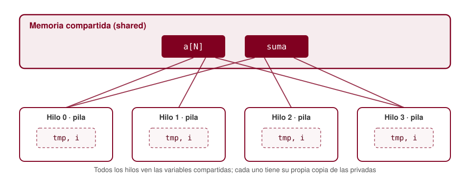

<!-- _class: lead -->
<!-- _paginate: false -->

# OpenMP

## Ámbito de datos y sincronización

Programación Paralela · Escuela de Ingeniería de Sistemas e Informática · UIS

---

## Agenda

1. Repaso: la condición de carrera
2. Variables compartidas y privadas
3. Reglas de ámbito por defecto
4. Cláusulas `shared`, `private`, `firstprivate`, `lastprivate`
5. `default(none)`: ámbito explícito
6. Exclusión mutua: `critical` y `atomic`
7. Barreras: `barrier` y `nowait`
8. `single` y `masked`
9. Caso de estudio: histograma

---

## Repaso

```c
double suma = 0.0;
#pragma omp parallel for
for (int i = 0; i < N; i++)
    suma += a[i];          //  condición de carrera !!!!!!!
```

- En la sesión anterior se resolvió con `reduction(+:suma)`
- Pero no todo problema es una reducción: a veces hay que **decidir** qué ve cada hilo y **coordinar** los accesos
- Hoy: ¿qué datos **comparten** los hilos y cómo se **sincronizan**?

---

## Compartido vs. privado



- **Compartida** (`shared`): una sola instancia, visible para todos los hilos
- **Privada** (`private`): cada hilo tiene su **propia copia** en su pila

---

## Reglas de ámbito por defecto (C/C++)

| Variable | Ámbito por defecto |
|---|---|
| Declarada **fuera** de la región paralela | Compartida |
| Declarada **dentro** de la región paralela | Privada |
| Índice de un bucle con `omp for` | Privada |
| Variables `static` y globales | Compartidas |
| Variables locales de funciones llamadas desde la región | Privadas |

<p class="nota">Las reglas son cómodas, pero es fácil equivocarse: la mayoría de errores vienen de variables compartidas sin intención.</p>

---

## Trampa clásica: bucles anidados

```c
int i, j;
#pragma omp parallel for
for (i = 0; i < N; i++)
    for (j = 0; j < M; j++)     // incorrecto: j es COMPARTIDA
        c[i][j] = a[i][j] + b[i][j];
```

- Solo el índice del bucle asociado a `omp for` (`i`) se privatiza
- `j` se declaró fuera: todos los hilos modifican el **mismo** `j`

```c
#pragma omp parallel for private(j)            // opción 1
for (int i = 0; i < N; i++)
    for (int j = 0; j < M; j++)                // opción 2 (preferida)
```

---

## `private`

```c
double tmp;
#pragma omp parallel for private(tmp)
for (int i = 0; i < N; i++) {
    tmp  = a[i] * a[i];
    b[i] = tmp + 1.0;
}
```

- Cada hilo recibe una copia **sin inicializar**
- Los cambios en la copia **no se reflejan** en la variable original
- Buena práctica en C moderno: declarar la variable **dentro** de la región

---

## `private` no copia el valor

```c
int x = 10;
#pragma omp parallel private(x)
{
    printf("x = %d\n", x);   // incorrecto: valor indeterminado
    x = omp_get_thread_num();
}
printf("x = %d\n", x);       // la copia privada no sale de la región
```

- Leer una copia privada antes de asignarle un valor es un **error**
- Si se necesita el valor inicial → `firstprivate`

---

## `firstprivate` y `lastprivate`

```c
int offset = 100;
#pragma omp parallel for firstprivate(offset)
for (int i = 0; i < N; i++)
    b[i] = a[i] + offset;     // cada copia arranca en 100
```

```c
double ultimo;
#pragma omp parallel for lastprivate(ultimo)
for (int i = 0; i < N; i++)
    ultimo = f(a[i]);
// ultimo = valor de la iteración i = N-1 (la última en orden secuencial)
```

- `firstprivate`: copia privada **inicializada** con el valor original
- `lastprivate`: al terminar, el original recibe el valor de la **última iteración secuencial**, no del último hilo en terminar

---

## Resumen de cláusulas de ámbito

| Cláusula | Copias | Valor inicial | Valor al salir |
|---|---|---|---|
| `shared` | Una | — | Visible para todos |
| `private` | Una por hilo | Indeterminado | No se propaga |
| `firstprivate` | Una por hilo | Valor original | No se propaga |
| `lastprivate` | Una por hilo | Indeterminado | Última iteración |
| `reduction` | Una por hilo | Neutro del operador | Combinación |

---

## `default(none)`: ámbito explícito

```c
#pragma omp parallel for default(none) shared(a, b, N) private(tmp)
for (int i = 0; i < N; i++) {
    tmp  = a[i] * a[i];
    b[i] = tmp + 1.0;
}
```

- Obliga a declarar el ámbito de **toda** variable usada en la región
- Si falta alguna, el compilador da **error**
- Recomendación: usarlo mientras se aprende y en código crítico

---

## Sincronización

Dos necesidades distintas:

- **Exclusión mutua**: que solo un hilo a la vez ejecute un fragmento de código o actualice un dato
  → `critical`, `atomic`
- **Coordinación de eventos**: que ningún hilo avance hasta que todos lleguen a un punto
  → `barrier` (y las barreras implícitas)

<p class="nota">Toda sincronización tiene un costo: hilos que esperan son hilos que no calculan.</p>

---

## `critical`

```c
double max_global = -INFINITY;

#pragma omp parallel for
for (int i = 0; i < N; i++) {
    double v = f(a[i]);
    #pragma omp critical
    {
        if (v > max_global) max_global = v;
    }
}
```

- El bloque es una **sección crítica**: un solo hilo a la vez
- Permite proteger **bloques arbitrarios** de código
- Los demás hilos **esperan** en la entrada

---

## Secciones críticas con nombre

```c
#pragma omp critical (cola_entrada)
{ encolar(&entrada, x); }

#pragma omp critical (cola_salida)
{ encolar(&salida, y); }
```

- Todas las secciones `critical` **sin nombre** comparten un mismo candado global
- Con nombre, secciones que protegen **datos distintos** pueden ejecutarse a la vez
- Nombres iguales → mismo candado

---

## `atomic`

```c
#pragma omp parallel for
for (int i = 0; i < N; i++) {
    double v = f(a[i]);
    #pragma omp atomic
    suma += v;
}
```

- Protege **una sola actualización** de una variable escalar
- Formas válidas: `x op= expr`, `x++`, `++x`, `x--`, `--x`, `x = x op expr`
- Suele traducirse a **instrucciones atómicas** del hardware → mucho más barato que `critical`
- Solo la actualización de `x` es atómica; `expr` se evalúa sin protección

---

## `critical` vs. `atomic` vs. `reduction`

| | `critical` | `atomic` | `reduction` |
|---|---|---|---|
| Protege | Bloque arbitrario | Una actualización | Una acumulación |
| Mecanismo | Candado | Instrucción de hardware | Copias privadas |
| Costo por uso | Alto | Bajo | Casi nulo en el bucle |
| Contención | Serializa | Serializa sobre un dato | Ninguna |

<p class="nota">Regla práctica: si es una reducción, use <code>reduction</code>; si es una única actualización, <code>atomic</code>; lo demás, <code>critical</code>.</p>

---

## El costo de sincronizar en el bucle

```c
#pragma omp parallel for
for (int i = 0; i < N; i++) {
    #pragma omp critical
    suma += a[i];            // importante: correcto, pero secuencial
}
```

- Resultado **correcto**, pero todo el trabajo útil ocurre dentro de la sección crítica
- Suele ser **más lento que la versión secuencial**: se suma el costo del candado
- Mejor: acumular en una variable **privada** y sincronizar **una vez por hilo**

---

## Acumular localmente, combinar una vez

```c
double suma = 0.0;
#pragma omp parallel
{
    double local = 0.0;            // privada: declarada en la región
    #pragma omp for
    for (int i = 0; i < N; i++)
        local += a[i];

    #pragma omp atomic
    suma += local;                 // una actualización por hilo
}
```

- Es exactamente lo que hace `reduction` internamente
- Útil cuando la combinación **no** es un operador de reducción estándar

---

## Barreras

```c
#pragma omp parallel
{
    calcular_fase1(omp_get_thread_num());
    #pragma omp barrier            // nadie sigue hasta que todos terminen
    calcular_fase2(omp_get_thread_num());   // usa resultados de la fase 1
}
```

**Barreras implícitas** al final de:
`parallel` · `for` · `single` · `sections`

<p class="nota">Una barrera debe ser alcanzada por <strong>todos</strong> los hilos del equipo o por ninguno: dentro de un <code>if</code> que no todos cumplen, el programa se bloquea.</p>

---

## `nowait`: eliminar la barrera implícita

```c
#pragma omp parallel
{
    #pragma omp for nowait
    for (int i = 0; i < N; i++)
        b[i] = f(a[i]);

    #pragma omp for
    for (int i = 0; i < M; i++)
        d[i] = g(c[i]);            // no depende de b
}
```

- Los hilos que terminan el primer bucle pasan al segundo **sin esperar**
- Solo es seguro si el segundo bucle **no depende** de los resultados del primero
- La barrera final del `parallel` **no** se puede eliminar

---

## `single` y `masked`

```c
#pragma omp parallel
{
    #pragma omp single
    leer_parametros(&cfg);        // un hilo cualquiera; barrera al final

    procesar(&cfg, omp_get_thread_num());

    #pragma omp masked
    printf("Progreso: fase completada\n");   // solo el hilo 0; sin barrera
}
```

| | `single` | `masked` |
|---|---|---|
| ¿Quién ejecuta? | Un hilo cualquiera | El hilo maestro (0) |
| ¿Barrera implícita? | Sí (salvo `nowait`) | No |

<p class="nota"><code>masked</code> (OpenMP 5.1) reemplaza a <code>master</code>, que queda obsoleta.</p>

---

## Caso de estudio: histograma

```c
int hist[NB] = {0};

for (long i = 0; i < N; i++) {
    int k = (int)(datos[i] * NB);   // datos en [0, 1)
    hist[k]++;
}
```

- Varios hilos pueden incrementar **la misma casilla** a la vez
- La casilla a actualizar no se conoce hasta ejecutar la iteración
- Comparemos cuatro estrategias

---

## Histograma: cuatro versiones

```c
// A) critical: correcto, muy lento
#pragma omp parallel for
for (long i = 0; i < N; i++) {
    int k = (int)(datos[i] * NB);
    #pragma omp critical
    hist[k]++;
}

// B) atomic: correcto, más rápido
    #pragma omp atomic
    hist[k]++;

// C) reducción sobre arreglo (OpenMP ≥ 4.5)
#pragma omp parallel for reduction(+:hist[:NB])
for (long i = 0; i < N; i++)
    hist[(int)(datos[i] * NB)]++;
```

**D)** histograma privado por hilo + combinación final con `atomic` (ejercicio)

---

## Compartición falsa (*false sharing*)

```c
double parcial[NUM_HILOS];      // incorrecto: contiguos en memoria
#pragma omp parallel
{
    int id = omp_get_thread_num();
    for (...) parcial[id] += ...;
}
```

- Cada hilo escribe en **su** casilla: no hay carrera, el resultado es correcto
- Pero varias casillas comparten una **línea de caché** (típicamente 64 bytes)
- Cada escritura invalida la línea en los demás núcleos → el rendimiento se desploma
- Solución: acumular en una variable **local** (privada) o separar con relleno (*padding*)

---

## Errores frecuentes

- Índices de bucles internos declarados fuera de la región (quedan **compartidos**)
- Leer una variable `private` sin inicializar (use `firstprivate`)
- Esperar que `lastprivate` dé el valor del último hilo en terminar
- `critical` dentro del cuerpo de un bucle con mucho trabajo por iteración: se serializa
- `barrier` dentro de un condicional que no todos los hilos cumplen → **bloqueo**
- `nowait` cuando el siguiente bucle **sí** depende del anterior

---

## Resumen

| Construcción | Función |
|---|---|
| `shared` / `private` | Una instancia / una copia por hilo |
| `firstprivate` / `lastprivate` | Copia inicializada / último valor secuencial |
| `default(none)` | Obliga a declarar el ámbito de todo |
| `critical [(nombre)]` | Exclusión mutua sobre un bloque |
| `atomic` | Actualización atómica de un escalar |
| `barrier` / `nowait` | Añadir / quitar punto de espera |
| `single` / `masked` | Un hilo cualquiera / el hilo 0 |

---

## Ejercicios propuestos

1. Reescriba el producto matriz-vector de la sesión anterior con `default(none)` y declare el ámbito de todas las variables
2. Implemente la versión **D** del histograma (privado por hilo + combinación) y compare tiempos con **A**, **B** y **C** para $N = 10^8$
3. Calcule el máximo de un arreglo con `critical`, con acumulación local y con `reduction(max:...)`; mida y explique las diferencias
4. Muestre experimentalmente la compartición falsa: acumule en `parcial[id]` con y sin relleno de 64 bytes y compare tiempos
5. Encuentre y corrija el error:
   `#pragma omp parallel` `{ if (omp_get_thread_num() < 2) { ... #pragma omp barrier } }`

---

<!-- _class: lead -->
<!-- _paginate: false -->

# Próxima sesión

## Planificación de bucles y tareas

`schedule` · `static` · `dynamic` · `guided` · `task` · `taskwait`
