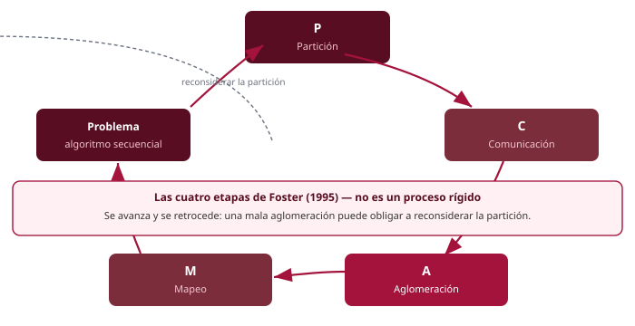
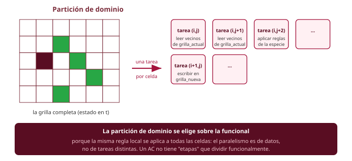
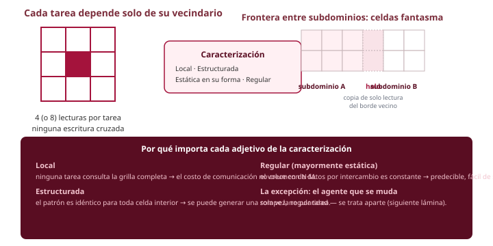
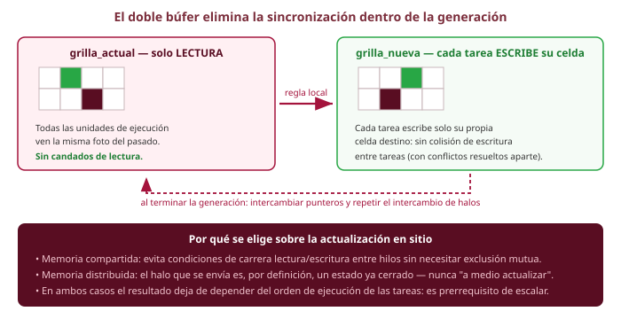
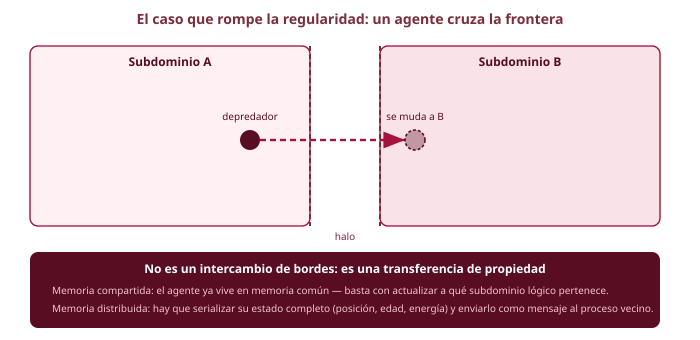
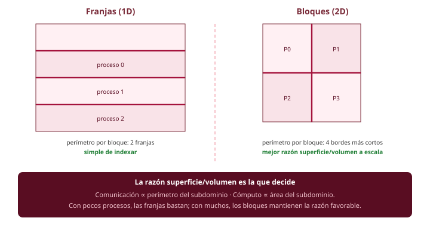
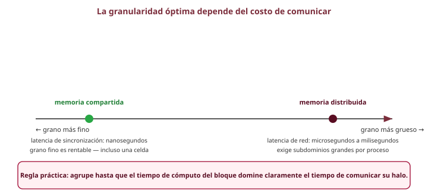
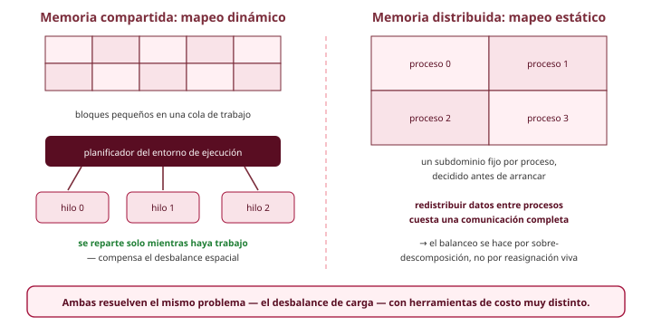
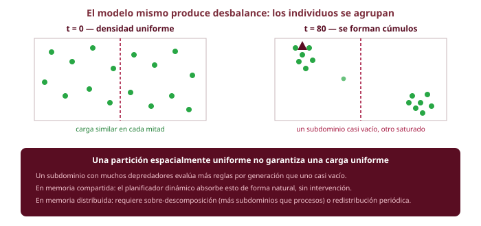
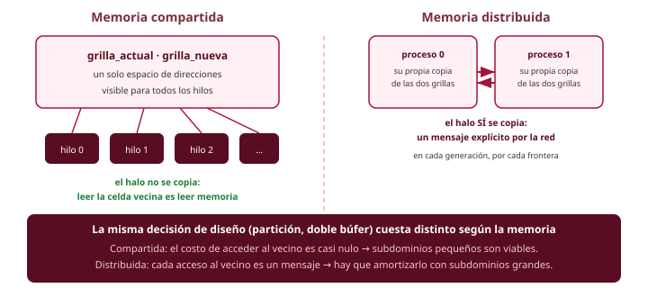

<!-- _class: portada -->
<!-- _paginate: false -->
<!-- _header: "" -->
<!-- _footer: "" -->

# Diseño Paralelo del Modelo Depredador–Presa

## Análisis PCAM para memoria compartida y distribuida

### Programación Paralela · Escuela de Ingeniería de Sistemas e Informática

<!--
Esta sesión retoma el modelo depredador-presa de la sesión secuencial y aplica la metodología PCAM de Foster para decidir, paso a paso, cómo repartirlo entre varias unidades de ejecución.
El objetivo no es entregar código: es que cada decisión de diseño quede justificada antes de escribir una sola línea paralela. El código en sí es materia del taller práctico.
Se asume de entrada que la misma cadena de razonamiento debe servir tanto para memoria compartida como distribuida, y el análisis va señalando en qué punto se bifurcan.
-->

---

# Agenda

1. Punto de partida: qué hereda este análisis de la sesión secuencial
2. La metodología PCAM
3. **Partición:** identificar el paralelismo máximo
4. **Comunicación:** de qué depende cada tarea
5. **Aglomeración:** agrupar para reducir el costo de comunicar
6. **Mapeo:** asignar el trabajo a hilos y a procesos
7. Síntesis comparativa: memoria compartida frente a memoria distribuida
8. Lo que no cambia al paralelizar
9. Ejercicio propuesto

<!--
El hilo conductor de toda la sesión es "por qué", no "cómo". Cada etapa de PCAM tiene una lámina dedicada a justificar la decisión, y al final hay una tabla que resume las cuatro etapas lado a lado para las dos memorias.
Tiempo sugerido: 10 min para el punto de partida y PCAM en general, 15 min por cada una de las cuatro etapas, 15 min para la síntesis, y el resto para el ejercicio.
-->

---

<!-- _class: seccion -->

# Parte I
## Punto de partida

---

# Qué hereda este análisis de la sesión anterior

En el taller secuencial fijamos, y aquí se mantienen sin cambio:

- **Grilla toroidal**, con vecindario configurable (Von Neumann o Moore)
- **Individuos discretos**: presa y depredador, con edad y, el segundo, energía
- **Reglas configurables**: movimiento, alimentación, reproducción y muerte como funciones intercambiables, no como condiciones dentro del motor
- **Esquema de actualización por doble búfer**: `grilla_actual` de solo lectura, `grilla_nueva` de escritura

Lo único que cambia es la pregunta: ya no "¿cómo simulo esto?", sino **"¿cómo lo reparto entre varias unidades de ejecución sin cambiar lo que el modelo significa?"**

<!--
Insista en el último punto: el objetivo de todo el análisis que sigue es que el resultado de la simulación paralela sea el mismo modelo, con la misma semántica, no una aproximación ni una versión distinta.
El doble búfer se fija aquí como decisión previa, no como conclusión de PCAM: en la sesión anterior se presentó como una alternativa entre varias; en esta, la damos por tomada porque es la que mejor se presta a paralelizarse, y la propia comunicación (parte IV) explicará por qué.
-->

---

# Nomenclatura

Se conserva la nomenclatura genérica de todo el material del curso:

| Término | Significado |
|---|---|
| **Presa** | individuo que se mueve y se reproduce |
| **Depredador** | individuo que se mueve, come, se reproduce y puede morir de inanición |
| **Celda** | posición de la grilla; contiene a lo sumo un individuo |
| **Tarea primitiva** | la unidad de trabajo más pequeña que identifica PCAM: aquí, una celda |
| **Unidad de ejecución** | un hilo (memoria compartida) o un proceso (memoria distribuida) |

Se evita deliberadamente nombrar una tecnología concreta hasta la síntesis final: el razonamiento de PCAM es el mismo independientemente de si esa "unidad de ejecución" termina siendo un hilo con memoria compartida o un proceso con paso de mensajes.

<!--
"Unidad de ejecución" es el término paraguas que uso durante toda la presentación para no comprometerme con hilo o proceso hasta que la decisión realmente dependa de eso. Es una elección deliberada: quiero que las diapositivas de partición y comunicación sean válidas para ambas arquitecturas sin reescritura.
-->

---

<!-- _class: seccion -->

# Parte II
## La metodología PCAM

---

# ¿Qué es PCAM?

Propuesta por **Ian Foster** en *Designing and Building Parallel Programs* (1995), PCAM organiza el diseño de un programa paralelo en cuatro etapas:

- **P**artición — descomponer el problema en tareas
- **C**omunicación — determinar qué dependencias de datos existen entre tareas
- **A**glomeración — agrupar tareas para reducir el costo de comunicar
- **M**apeo — asignar los grupos resultantes a las unidades de ejecución disponibles

Las dos primeras etapas son **independientes de la máquina**; las dos últimas son donde entra la arquitectura concreta.

<!--
Esta separación es la razón por la que PCAM es útil incluso cuando, como en este caso, el destino final son dos arquitecturas distintas: partición y comunicación se analizan una sola vez, y solo aglomeración y mapeo se bifurcan.
-->

---

# El ciclo PCAM

<!--
Aunque se presenta como una secuencia, en la práctica es iterativo: una mala decisión de aglomeración puede obligar a reconsiderar la partición original. En esta sesión seguiremos el orden lineal por claridad, pero adviértales que en el ejercicio es normal ir y volver.
-->

---

<!-- _class: seccion -->

# Parte III
## Partición

---

# Partición: identificar el paralelismo máximo

El objetivo de esta etapa es descomponer el problema en la **mayor cantidad posible** de tareas pequeñas, sin preocuparse todavía por cuántas unidades de ejecución habrá disponibles. Agrupar es trabajo de la aglomeración, no de esta etapa.

Dos estrategias clásicas:

- **Partición funcional**: se divide por las distintas operaciones del problema (por ejemplo, una etapa que filtra y otra que agrega).
- **Partición de dominio**: se divide por los datos, y la misma operación se replica sobre cada porción.

<!--
Este es el primer punto donde vale la pena parar y preguntar al grupo cuál de las dos estrategias esperan que aplique aquí, antes de revelarlo en la siguiente lámina. La respuesta debería ser evidente si retuvieron bien la definición de autómata celular de la sesión anterior.
-->

---

# Por qué domina la partición de dominio

En nuestro modelo no hay etapas distintas que dividir: **cada celda ejecuta la misma regla local**, la que corresponda según si contiene una presa, un depredador o nada. Eso es, por definición, paralelismo de datos.

> La partición funcional tendría sentido si, por ejemplo, un módulo calculara vecindarios y otro aplicara reglas como una tubería. No es así como está diseñado el motor: motor y reglas ya están separados, pero eso es una separación de responsabilidades, no una partición paralela.

**Decisión:** partición de dominio sobre la grilla.

<!--
Vale la pena conectar esto con la lámina "separe el motor de las reglas" de la sesión anterior: esa separación fue una decisión de arquitectura de software, no de paralelismo. Aquí el paralelismo viene de otro lado: de que la grilla tiene N×M celdas independientes.
-->

---

# Tareas primitivas: una celda, una tarea

<!--
Note que la tarea primitiva no es "un individuo": es una celda. La diferencia importa porque el número de celdas es fijo (N×M) durante toda la simulación, mientras que el número de individuos cambia generación a generación. Una partición basada en individuos tendría que rehacerse constantemente; una basada en celdas, no.
-->

---

# Qué necesita cada tarea primitiva

Para completar su trabajo en una generación, la tarea de la celda `(i, j)` necesita:

- El estado de su **propia celda** en `grilla_actual`
- El estado de sus **celdas vecinas** en `grilla_actual` (4 u 8, según el vecindario elegido)
- Las **reglas de la especie** correspondiente (movimiento, alimentación, reproducción, muerte)

Y produce:

- El nuevo estado de su celda en `grilla_nueva`

Con N×M celdas, la partición produce **N×M tareas primitivas**, casi todas idénticas en forma y todas potencialmente independientes entre sí dentro de una misma generación.

<!--
"Casi todas idénticas en forma" es deliberado: hay una asimetría real entre una celda vacía (trabajo mínimo: comprobar que sigue vacía) y una celda con un depredador (trabajo máximo: buscar presa, decidir, quizá reproducirse). Esa asimetría es la semilla del problema de balance de carga que aparece en la parte de mapeo.
-->

---

<!-- _class: seccion -->

# Parte IV
## Comunicación

---

# Comunicación: de qué depende cada tarea

Con la partición ya definida, esta etapa pregunta: **¿qué datos necesita una tarea que no le pertenecen a ella?**

En nuestro caso, la respuesta es siempre la misma forma: el estado de las celdas vecinas, en el instante anterior. La tarea nunca necesita nada de una celda lejana, y nunca necesita el estado *futuro* de ninguna celda.

Esta etapa no decide todavía **cómo** se transportan esos datos entre unidades de ejecución — eso depende de la memoria y se resuelve en el mapeo — sino **qué dependencias existen** y **con qué forma**.

<!--
Insista en la distinción entre "qué depende de qué" (comunicación, aquí) y "cómo se implementa ese transporte" (mapeo, más adelante). Es habitual que el grupo salte directo a pensar en MPI_Sendrecv o en variables compartidas; PCAM pide posponer esa decisión.
-->

---

# El patrón: vecindario, local, estructurado

<!--
El recuadro de caracterización de la izquierda usa el vocabulario estándar de Foster para describir patrones de comunicación: local (no global), estructurada (con una forma regular, no arbitraria), y mayormente estática salvo por el caso de los agentes que se mudan, que se trata aparte en la siguiente lámina.
-->

---

# Por qué el doble búfer resuelve la comunicación

Con actualización en sitio, la tarea de la celda `(i, j)` no puede saber si el vecino que está leyendo ya se actualizó en esta generación o todavía no: la dependencia se vuelve **ambigua**.

Con doble búfer, la dependencia es inequívoca: **toda lectura mira a `grilla_actual`, un estado ya cerrado**. Esto es exactamente lo que la etapa de comunicación necesita para poder decir, sin ambigüedad, qué depende de qué.

<!--
Esta es la lámina que conecta la decisión de la sesión secuencial (doble búfer) con la razón profunda por la que se conserva aquí: sin ella, ni siquiera se puede caracterizar limpiamente el patrón de comunicación, porque las dependencias dejarían de ser estáticas dentro de la generación.
-->

---

# El caso especial: el agente que se muda

<!--
Este es el punto donde el modelo depredador-presa se separa de un autómata celular "puro" como el Juego de la Vida: ahí ninguna información viaja más allá del vecindario inmediato. Aquí, un individuo puede cruzar la frontera de un subdominio y todo su estado —posición, edad, energía— tiene que viajar con él.
Anticipe que este caso se resuelve de forma completamente distinta según la memoria, y que ese contraste es tal vez el punto más instructivo de la sesión: se retoma en la síntesis final.
-->

---

# Caracterización completa de la comunicación

| Propiedad | Valor | Consecuencia de diseño |
|---|---|---|
| Alcance | Local | El costo no crece con el tamaño total de la grilla |
| Estructura | Estructurada (regular) | El patrón de intercambio se genera una sola vez |
| Volumen por intercambio | Constante (halo) | Predecible; permite reservar buffers de tamaño fijo |
| Sincronización | Por generación | Todas las tareas deben cerrar su lectura antes de avanzar |
| Regularidad temporal | Casi estática | La excepción es la migración de agentes |

**Decisión:** intercambio de halos (celdas fantasma) en cada frontera de subdominio, una vez por generación, más un mecanismo aparte para la migración de agentes.

<!--
Esta tabla es el resumen que conviene que el estudiante tenga a mano al llegar al ejercicio: son las cinco preguntas que PCAM exige responder en la etapa de comunicación, aplicadas a este problema concreto.
-->

---

<!-- _class: seccion -->

# Parte V
## Aglomeración

---

# Por qué no dejar una tarea por celda

Nada impide, en principio, crear una tarea paralela por cada una de las N×M celdas. En la práctica, eso es indeseable:

- El **costo de crear y sincronizar** cada unidad de trabajo (un hilo, un mensaje) rara vez es gratuito, y con tareas tan pequeñas ese costo puede superar al trabajo útil.
- La **razón entre comunicación y cómputo** empeora cuanto más pequeña es cada tarea: una celda aislada tiene el mismo perímetro de comunicación que de cómputo.
- No aprovecha la **localidad**: celdas vecinas en la grilla deberían, idealmente, vivir cerca en memoria y ser procesadas por la misma unidad de ejecución.

**El objetivo de la aglomeración es agrupar tareas primitivas en bloques**, hasta que el cómputo de cada bloque domine claramente su costo de comunicación.

<!--
El ejemplo más simple para ilustrar la razón comunicación/cómputo: una tarea de 1 celda tiene hasta 8 vecinos que consultar (Moore) para hacer el trabajo de 1 celda. Un bloque de 10×10 celdas tiene un perímetro de 40 celdas para hacer el trabajo de 100. La proporción mejora con el tamaño del bloque.
-->

---

# Franjas o bloques: la razón superficie/volumen

<!--
Esta es la decisión clásica de descomposición de dominio en cómputo científico, y aplica igual aquí. La elección entre franjas y bloques no depende del modelo depredador-presa en sí, sino del número de unidades de ejecución disponibles: con pocas, las franjas son más simples de programar y casi igual de eficientes; con muchas, los bloques se vuelven necesarios.
-->

---

# Granularidad: memoria compartida frente a distribuida

<!--
Esta lámina anticipa la bifurcación que se formaliza en el mapeo. La razón de fondo es física: sincronizar dos hilos que comparten memoria cuesta un puñado de ciclos de reloj; enviar un mensaje por red cuesta órdenes de magnitud más. La granularidad óptima no es una propiedad del algoritmo, sino de la relación entre cómputo y comunicación de la máquina destino.
-->

---

# Qué se agrupa exactamente

En este modelo, la aglomeración agrupa:

- **Celdas contiguas de la grilla** en subdominios (franjas o bloques)
- Dentro de cada subdominio, **las tareas de todas las celdas se ejecutan como una unidad de trabajo secuencial**, recorriendo primero presas y luego depredadores, tal como en la versión secuencial
- El **halo** de cada subdominio: en lugar de comunicar celda por celda, se agrupa el borde completo en un solo intercambio por generación

Lo que **no** se agrupa: la semántica del doble búfer se mantiene intacta dentro de cada subdominio — cada uno conserva su propia `grilla_actual` y `grilla_nueva` locales.

<!--
Vale la pena remarcar que la aglomeración no toca el modelo ni las reglas configurables: agrupa la forma en que se distribuye el trabajo, no el contenido de lo que se calcula. Es una decisión puramente de ingeniería del paralelismo.
-->

---

<!-- _class: seccion -->

# Parte VI
## Mapeo

---

# Mapeo: asignar los bloques a unidades de ejecución

Con los subdominios ya definidos, el mapeo decide **cuál unidad de ejecución procesa cuál subdominio**, buscando dos objetivos que a menudo compiten:

- **Balancear la carga**: que ninguna unidad de ejecución espere ociosa mientras otra sigue trabajando
- **Minimizar la comunicación entre unidades**: que las que más se comunican queden, en lo posible, más cerca

Es aquí donde la elección entre memoria compartida y memoria distribuida deja de ser una anticipación y se vuelve la decisión central.

<!--
El mapeo es, junto con la aglomeración, la etapa donde entra la máquina concreta. A partir de esta lámina el análisis se bifurca explícitamente en dos caminos, que se recorren en paralelo en las láminas siguientes y se cierran en la tabla de síntesis.
-->

---

# Mapeo estático o dinámico

<!--
La pregunta que resume esta lámina: ¿cuánto cuesta mover un subdominio de una unidad de ejecución a otra a mitad de la simulación? En memoria compartida, casi nada: es solo cambiar qué hilo procesa qué región de una memoria que todos ven igual. En memoria distribuida, implica enviar todo el estado del subdominio por la red: caro, y por eso se evita.
-->

---

# El desbalance que introduce el propio modelo

<!--
Esta es la razón por la que el mapeo no puede resolverse de una vez al principio y olvidarse: el modelo depredador-presa, a diferencia de un problema con carga fija como una multiplicación de matrices, cambia su distribución de trabajo con el tiempo. Los individuos se agrupan por las propias dinámicas de caza y reproducción.
-->

---

# Estrategias frente al desbalance

| Estrategia | Dónde funciona mejor | Costo |
|---|---|---|
| Planificación dinámica del sistema de hilos | Memoria compartida | Prácticamente nulo: lo hace el entorno de ejecución |
| Sobre-descomposición (más subdominios que unidades) | Ambas, más útil en distribuida | Más mensajes de halo, pero cada uno más pequeño |
| Redistribución periódica de subdominios | Memoria distribuida | Una migración completa de datos, cada cierto número de generaciones |
| Robo de trabajo (*work stealing*) | Memoria compartida | Bajo, si el entorno de ejecución lo soporta de forma nativa |

**Decisión de diseño:** en memoria compartida, mapeo dinámico de bloques pequeños es la opción natural y casi gratuita. En memoria distribuida, mapeo estático con sobre-descomposición moderada, aceptando que el balance nunca será perfecto.

<!--
Anime al grupo a no perseguir el balance perfecto en la versión distribuida: el costo de conseguirlo (redistribuciones frecuentes) puede superar fácilmente el tiempo que se ahorra. Es un intercambio, no un problema a resolver por completo.
-->

---

<!-- _class: seccion -->

# Parte VII
## Síntesis comparativa

---

# Las cuatro etapas, lado a lado

| Etapa | Memoria compartida | Memoria distribuida |
|---|---|---|
| **Partición** | Igual — de dominio, una tarea por celda | Igual — de dominio, una tarea por celda |
| **Comunicación** | Igual — halo local y estructurado | Igual — halo local y estructurado |
| **Aglomeración** | Grano más fino viable | Grano grueso obligatorio |
| **Mapeo** | Dinámico, casi gratuito | Estático, con sobre-descomposición |

Las dos primeras filas son **independientes de la máquina**: es la parte de PCAM que se razona una sola vez. Las dos últimas son donde la arquitectura decide.

<!--
Esta tabla es, en cierto sentido, la conclusión de toda la sesión: la mitad del trabajo de diseño (partición y comunicación) sirve sin cambios para cualquier arquitectura de memoria. Solo la segunda mitad exige una decisión distinta, y esa decisión está gobernada por un solo factor: el costo relativo de comunicar frente a computar.
-->

---

# Cómo cambia el costo del halo según la memoria

<!--
Esta lámina hace explícito lo que las anteriores fueron anticipando: la comunicación identificada en la parte IV es la misma en abstracto, pero su costo real —y por tanto el tamaño de bloque razonable— depende enteramente de si esa lectura del vecino cuesta un acceso a memoria o un mensaje de red.
-->

---

# La migración de agentes, resuelta en cada arquitectura

| | Memoria compartida | Memoria distribuida |
|---|---|---|
| **Qué ocurre** | El agente ya está en memoria visible para todos | Su estado debe serializarse y enviarse |
| **Mecanismo** | Actualizar a qué subdominio lógico pertenece | Mensaje explícito al proceso vecino |
| **Costo relativo** | Bajo — es metadato, no movimiento de datos | Comparable al de un intercambio de halo, pero irregular en el tiempo |
| **Riesgo si se ignora** | Condición de carrera sobre la celda destino | Un individuo que "desaparece" o se duplica entre procesos |

<!--
El riesgo de la última fila merece mención explícita: en memoria compartida, dos hilos podrían intentar mover distintos agentes a la misma celda frontera; en distribuida, un agente puede quedar en tránsito y, si no se contabiliza con cuidado, aparecer simultáneamente en dos procesos o en ninguno durante una generación. Ambos son errores de sincronización, con síntomas de "porcentaje de conflicto" no nulo si se instrumenta como en el simulador de la sesión anterior.
-->

---

<!-- _class: seccion -->

# Parte VIII
## Cierre

---

# Lo que no cambia al paralelizar

Toda la arquitectura de la versión secuencial sobrevive intacta:

- Las **reglas configurables** de movimiento, alimentación, reproducción y muerte no se tocan: siguen siendo funciones que el motor invoca sin conocer su contenido
- El **doble búfer** sigue siendo el mecanismo de actualización, ahora replicado por subdominio
- La **semántica del modelo** —qué significa una generación, qué significa que una presa se reproduzca— es idéntica a la versión secuencial

Lo que cambia es exclusivamente **cómo se distribuye el trabajo**, nunca **qué se calcula**. Esa separación es, en el fondo, la misma que ya exigía el taller anterior entre motor y reglas: aquí se extiende a la distribución del trabajo.

<!--
Este es el mensaje de cierre que conviene dejar explícito: PCAM bien aplicado no cambia el resultado del modelo, solo la manera de producirlo. Si al paralelizar cambia la dinámica de poblaciones observada, algo se hizo mal — probablemente en la comunicación o en el manejo de la migración de agentes.
-->

---

# Ejercicio propuesto

**Objetivo:** documentar el análisis PCAM completo para su propia configuración de reglas de la sesión anterior, y justificar cada decisión con una frase.

**Entregable — un documento breve con:**

1. **Partición:** confirme que aplica en su caso la partición de dominio y defina la tarea primitiva
2. **Comunicación:** identifique el vecindario usado y caracterice el patrón (local, estructurado, volumen del halo)
3. **Aglomeración:** elija franjas o bloques para su tamaño de grilla y justifique la elección con la razón superficie/volumen
4. **Mapeo:** proponga, para memoria compartida **y** para memoria distribuida, una estrategia de mapeo y de balanceo de carga

No se pide código: se pide el razonamiento, con la misma estructura de esta presentación, aplicado a su propio modelo.

<!--
Es intencional que el ejercicio no pida implementación todavía. El objetivo es que el análisis de diseño quede completo y por escrito antes de que empiecen a programar, precisamente para que la implementación no se convierta en la única oportunidad de pensar estas decisiones.
La implementación misma —con la tecnología concreta que usted decida para cada arquitectura— es la materia del taller práctico siguiente.
-->

---

# Referencias

- Foster, I. *Designing and Building Parallel Programs: Concepts and Tools for Parallel Software Engineering*. Addison-Wesley, 1995.
- Grama, A., Gupta, A., Karypis, G., Kumar, V. *Introduction to Parallel Computing*. 2ª ed., Addison-Wesley, 2003.
- Toffoli, T., Margolus, N. *Cellular Automata Machines: A New Environment for Modeling*. MIT Press, 1987.

<!--
El libro de Foster está disponible en línea de forma gratuita por el propio autor y es la referencia primaria de todo el vocabulario usado en esta sesión (tarea primitiva, aglomeración, razón superficie/volumen).
-->

---

<!-- _class: portada -->
<!-- _paginate: false -->
<!-- _header: "" -->
<!-- _footer: "" -->

# ¿Preguntas?

### Próximo taller: implementación en memoria compartida y en memoria distribuida

<!--
Cierre anunciando que el próximo paso es exactamente convertir estas decisiones en código: quien haya completado bien el ejercicio de esta sesión llega con el diseño resuelto y solo necesita traducirlo.
-->
