<!-- _class: portada -->
<!-- _paginate: false -->
<!-- _header: "" -->
<!-- _footer: "" -->

# Autómatas Celulares

## Modelo Depredador–Presa

### Programación Paralela · Escuela de Ingeniería de Sistemas e Informática

<!--
Esta sesión es completamente conceptual y secuencial: el objetivo es que el estudiante entienda el modelo y sepa expresarlo como algoritmo antes de pensar en rendimiento.
La paralelización del mismo problema se aborda en el taller siguiente, de modo que aquí no se menciona ninguna tecnología concreta.
Advierta desde el principio que todo el código de la sesión es pseudocódigo: la implementación es responsabilidad de ellos.
-->

---

# Agenda

1. ¿Qué es un autómata celular?
2. Componentes fundamentales y vecindarios
3. Ejemplo clásico: el Juego de la Vida
4. El problema depredador–presa y las ecuaciones de Lotka-Volterra
5. Formulación del modelo como autómata celular
6. Algoritmo y pseudocódigo
7. **Reglas configurables**: reproducción y muerte como puntos de extensión
8. Ejercicio propuesto (versión secuencial)

<!--
Tiempo sugerido: 25 min para las partes I y II, 20 min para la III, 35 min para la IV, 25 min para la V y el resto para el planteamiento del ejercicio.
La parte VII es la que realmente diferencia este taller: no se trata de implementar un modelo, sino un motor capaz de albergar varios modelos.
-->

---

<!-- _class: seccion -->

# Parte I
## Autómatas celulares

---

# ¿Qué es un autómata celular?

Un **autómata celular** (AC) es un modelo computacional discreto compuesto por:

- Una **grilla** de celdas (1D, 2D o 3D)
- Cada celda tiene un **estado** tomado de un conjunto finito
- El estado evoluciona en **pasos discretos** de tiempo
- El nuevo estado depende del estado actual y del de sus **vecinos**
- Las reglas son **locales** e **idénticas** para todas las celdas

> El comportamiento global complejo surge de reglas locales simples.

<!--
Insista en la palabra "local": ninguna celda consulta el estado global del sistema. Esa restricción es lo que hace del AC un modelo tan bien portado a arquitecturas de cómputo, aunque hoy no hablemos de ello.
Pregunte al grupo qué otros sistemas conocen que funcionen así (mallas de diferencias finitas, filtros de convolución, propagación de incendios).
-->

---

# Concepto visual

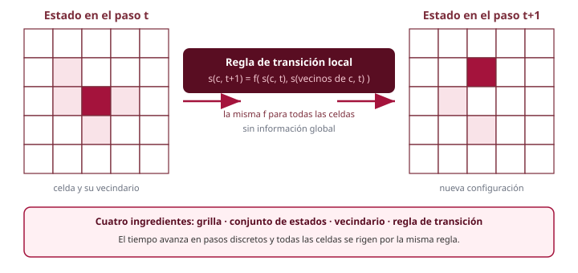

<!--
Lo esencial de la lámina: la misma función f se evalúa en todas las celdas, con la única diferencia de qué vecindario recibe como argumento.
Haga notar que en la grilla de la derecha el individuo cambió de posición: en un AC de agentes, la "transición de estado" incluye movimiento, lo cual introduce complicaciones que no existen en el Juego de la Vida.
-->

---

# Breve historia

**John von Neumann** (1940s): propuso los primeros autómatas celulares como modelos de auto-replicación, inspirado en la biología.

**Stanislaw Ulam** sugirió usar una grilla discreta en lugar de un modelo continuo.

**John Conway** (1970): creó el *Game of Life*, que popularizó los AC y demostró que reglas triviales pueden producir comportamiento impredecible.

**Stephen Wolfram** (1980s–2000s): clasificación sistemática de los AC unidimensionales. Publicó *A New Kind of Science* (2002), argumentando que los AC son fundamentales para comprender la naturaleza.

<!--
Von Neumann buscaba una respuesta a una pregunta muy concreta: ¿puede una máquina construir una copia de sí misma? Su autómata de 29 estados demostró que sí, al menos en el papel.
Ulam trabajaba en Los Álamos con crecimiento de cristales, y de ahí viene la idea de la grilla.
-->

---

# Componentes de un autómata celular

| Componente | Descripción |
|---|---|
| **Grilla** | Arreglo regular de celdas (línea, rectángulo, toroide…) |
| **Estado** | Valor discreto de cada celda (0/1, especies, atributos…) |
| **Vecindario** | Conjunto de celdas que influyen en la transición |
| **Regla de transición** | Función que calcula el nuevo estado a partir del actual y sus vecinos |
| **Condición de frontera** | Cómo se comportan los bordes (periódica, fija, abierta) |

<!--
Los cinco componentes son las cinco decisiones de diseño que ellos van a tomar en el ejercicio. Sugiera que las documenten explícitamente en el informe: es la diferencia entre "programé una simulación" y "modelé un sistema".
-->

---

# Vecindarios: Von Neumann y Moore

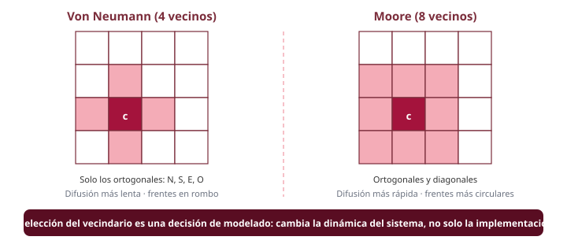

<!--
Nota práctica: con Moore el número de vecinos se duplica, así que también se duplica el costo de cada evaluación de la regla.
En el modelo depredador–presa usaremos Von Neumann por defecto, pero cambiar a Moore debería costar una línea si el motor está bien construido. Es un buen experimento para el informe.
-->

---

# ¿Por qué importa el vecindario?

La elección afecta directamente la dinámica del sistema:

- **Von Neumann (4 vecinos):** propagación más lenta, frentes con forma de rombo, menos oportunidades de movimiento por turno.
- **Moore (8 vecinos):** propagación más rápida, frentes más circulares, mayor mezcla entre poblaciones.

En un modelo ecológico, el vecindario representa el **alcance de percepción y desplazamiento** de un individuo en una unidad de tiempo. No es un detalle de implementación: es una hipótesis biológica.

<!--
Este es el punto donde conviene detenerse: los estudiantes tienden a ver el vecindario como un parámetro arbitrario. Enmarcarlo como hipótesis del modelo cambia la forma en que interpretan los resultados.
Si alguien pregunta por vecindarios de radio mayor, mencione el vecindario de Moore extendido de radio r y cómo se relaciona con la velocidad máxima de propagación de la información en la grilla.
-->

---

<!-- _class: seccion -->

# Parte II
## El Juego de la Vida

---

# El Juego de la Vida de Conway

Inventado en 1970, es el AC más conocido. Sus reglas son sorprendentemente simples:

- Grilla 2D (infinita en teoría, finita en la práctica)
- Cada celda está **viva** (1) o **muerta** (0)
- Vecindario de **Moore** (8 vecinos)
- Tres condiciones determinan el siguiente estado

Nos interesa como calentamiento: es el caso más simple posible del algoritmo que vamos a generalizar hoy.

<!--
Conway diseñó las reglas buscando deliberadamente un equilibrio: que ninguna configuración creciera sin límite de forma obvia, pero que tampoco todo se extinguiera rápidamente. Le tomó cerca de dos años de ensayo con tableros de Go.
-->

---

# Reglas del Juego de la Vida

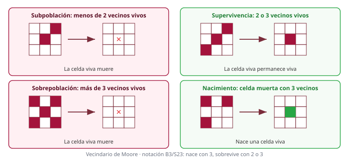

<!--
La notación B3/S23 es útil porque permite explorar variantes: B36/S23 es "HighLife", que tiene un replicador; B1/S12 produce fractales.
Sugerencia: si tienen tiempo, pídales que implementen Life primero. Son 30 líneas y les da el esqueleto del motor que necesitarán después.
-->

---

# Patrones emergentes

| Patrón | Descripción |
|---|---|
| **Naturalezas muertas** (*still lifes*) | No cambian entre generaciones (bloque, colmena) |
| **Osciladores** | Se repiten con periodo fijo (parpadeo, sapo) |
| **Naves** (*spaceships*) | Se desplazan por la grilla (planeador, LWSS) |
| **Máquinas** | Combinaciones que realizan cómputo |

Se demostró que el Juego de la Vida es **Turing-completo**: puede simular cualquier máquina de Turing.

<!--
El planeador es el patrón que conviene mostrar en vivo si hay proyección: cuatro fases, y al cabo de ellas la figura se ha desplazado una celda en diagonal.
La Turing-completitud se demostró con construcciones de cañones de planeadores que actúan como señales lógicas.
-->

---

# Relevancia computacional

El Juego de la Vida es importante porque demuestra que:

- La **complejidad** puede emerger de reglas simples
- Un sistema **determinista** puede producir resultados **impredecibles**
- La única forma de conocer el estado futuro suele ser **simular** paso a paso
- Todas las celdas aplican **la misma regla a datos distintos**

Este último punto lo retomaremos en el próximo taller. Por ahora, quédese con la estructura del algoritmo.

<!--
La irreductibilidad computacional (término de Wolfram) es la idea de fondo: no hay atajo analítico que prediga el estado en t=1000 sin recorrer los 1000 pasos. Por eso simulamos.
Deliberadamente no entramos aún en cómo aprovechar la uniformidad de la regla: eso es materia del taller siguiente.
-->

---

<!-- _class: seccion -->

# Parte III
## El problema depredador–presa

---

# Depredador–presa en la naturaleza

La relación entre especies que cazan y especies cazadas es uno de los fenómenos ecológicos mejor documentados:

- Lobos y alces en la Isla Royale (Michigan), con seguimiento continuo desde 1958
- Linces y liebres en Canadá, según los registros de pieles de la Compañía de la Bahía de Hudson (siglo XIX)
- Depredadores y peces en ecosistemas marinos

La observación clave: las **poblaciones oscilan** de forma cíclica y **desfasada**.

<!--
El caso lince-liebre es el más citado y también el más discutido: los datos son registros comerciales de pieles, no censos, y hay evidencia de que el ciclo de la liebre está también gobernado por la disponibilidad de vegetación. Vale la pena mencionarlo como advertencia sobre la interpretación de datos históricos.
-->

---

# El ciclo natural

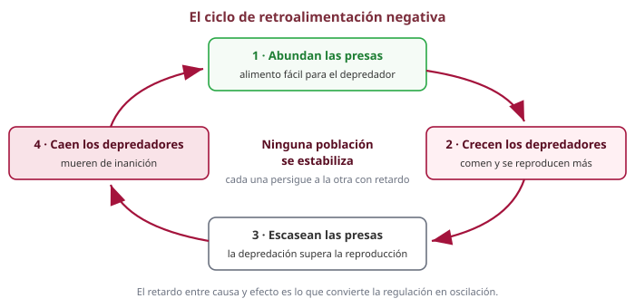

<!--
Pregunta útil para el grupo: ¿por qué no se llega simplemente a un punto de equilibrio donde ambas poblaciones se estabilicen?
La respuesta es el retardo: el depredador no responde instantáneamente a la abundancia de presas, sino después de comer, crecer y reproducirse. Cualquier sistema de control con retardo tiende a oscilar; es el mismo fenómeno que produce inestabilidad en un lazo de realimentación mal sintonizado.
-->

---

# Ecuaciones de Lotka-Volterra (1925–1926)

Alfred Lotka y Vito Volterra propusieron, de forma independiente, un modelo de ecuaciones diferenciales acopladas que captura esta dinámica oscilatoria.

Es el punto de referencia obligado: cualquier modelo que construyamos debe reproducir, al menos cualitativamente, lo que estas ecuaciones predicen.

<!--
Volterra llegó al problema por una vía curiosa: su yerno, el biólogo Umberto D'Ancona, había observado que durante la Primera Guerra Mundial, con menos pesca en el Adriático, la proporción de peces depredadores había aumentado. Volterra construyó el modelo para explicarlo.
Lotka había llegado a ecuaciones equivalentes estudiando reacciones químicas autocatalíticas.
-->

---

# Las ecuaciones

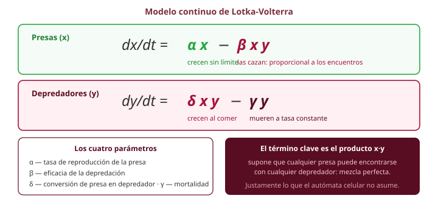

<!--
El término de encuentro x·y es el corazón del modelo y también su mayor debilidad: supone que el espacio no existe y que cualquier individuo puede toparse con cualquier otro (hipótesis de "mezcla perfecta", tomada prestada de la cinética química).
Ese es exactamente el supuesto que el autómata celular elimina.
-->

---

# Comportamiento de las ecuaciones

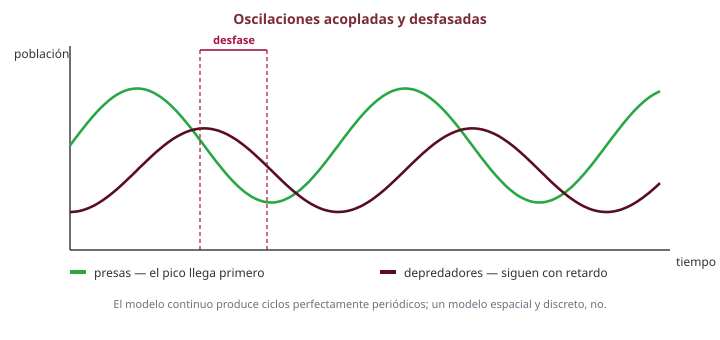

<!--
Haga notar el orden de los picos: primero la presa, después el depredador. Si en la simulación de ellos aparece el orden invertido, hay un error en el modelo o en el registro de datos.
El desfase teórico es de un cuarto de periodo.
-->

---

# Limitaciones del modelo analítico

Las ecuaciones son elegantes, pero descansan sobre supuestos fuertes:

- Poblaciones **continuas**: 0.37 depredadores no significa nada
- **Sin espacio**: todos los individuos se mezclan perfectamente
- Sin **edad**, sin **energía**, sin diferencias entre individuos
- Las oscilaciones son **estructuralmente inestables**: cualquier perturbación cambia la amplitud de forma permanente
- Nada impide que una población se acerque asintóticamente a cero sin extinguirse nunca

**Alternativa:** un autómata celular donde cada individuo es una entidad discreta situada en un espacio explícito.

<!--
El último punto es el más interesante desde el punto de vista del modelado: en el sistema continuo, una población de 10^-6 individuos se recupera; en el mundo real y en el AC, se extingue. Los modelos discretos capturan la extinción, los continuos no.
-->

---

<!-- _class: seccion -->

# Parte IV
## El modelo como autómata celular

---

# Traducción del modelo continuo al discreto

| Modelo continuo | Autómata celular |
|---|---|
| Población x(t), número real | Individuos discretos en celdas |
| Encuentros ∝ x·y | Encuentro solo entre celdas vecinas |
| Reproducción a tasa α | Regla local de reproducción |
| Mortalidad a tasa γ | Regla local de muerte |
| Espacio inexistente | Grilla toroidal N × M |
| Determinista | Estocástico (decisiones al azar) |

<!--
Esta tabla es el puente conceptual de toda la sesión. Cada fila de la izquierda se convierte en una decisión de diseño de la derecha.
Note la última fila: al introducir azar, dos ejecuciones con la misma configuración inicial darán resultados distintos. Por eso el informe debe reportar varias corridas, no una.
-->

---

# El mundo: una grilla toroidal

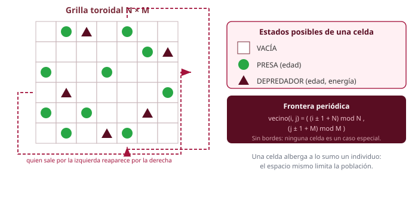

<!--
La frontera periódica evita tener que decidir qué pasa en los bordes y, sobre todo, evita el artefacto de que los individuos se acumulen en las esquinas.
La aritmética modular es la parte que más errores produce en las implementaciones: recuérdeles que en la mayoría de lenguajes el operador módulo con operandos negativos no devuelve lo que uno espera. De ahí el "+ N" antes del módulo.
-->

---

# El estado de una celda

Cada celda contiene **a lo sumo un individuo**:

| Estado | Atributos |
|---|---|
| `VACÍA` | ninguno |
| `PRESA` | edad |
| `DEPREDADOR` | edad, energía |

La restricción de un individuo por celda es lo que introduce, sin ninguna ecuación adicional, la **capacidad de carga** del sistema: el espacio se acaba.

<!--
Compare con Lotka-Volterra, donde la presa crece exponencialmente sin límite si no hay depredadores. Aquí no hace falta añadir un término logístico: la grilla se llena y la reproducción se detiene sola.
Es un buen ejemplo de cómo una restricción estructural del modelo sustituye a un parámetro.
-->

---

# Reglas de la presa

En cada generación, cada presa ejecuta un turno:

1. **Envejecer:** su edad aumenta en uno.
2. **Moverse:** elige al azar una celda vecina vacía y se desplaza a ella. Si no hay ninguna, permanece donde está.
3. **Reproducirse:** si se cumple la condición de reproducción, deja una **cría** en la celda que abandonó y su edad se reinicia.

Se supone que el alimento de la presa es ilimitado: solo la depredación y el espacio la limitan.

<!--
Detalle importante: la cría se deja en la celda de origen, no en el destino. Si la presa no se movió, no puede reproducirse (no hay espacio libre) — o bien se define una regla alternativa que busque cualquier vecina vacía. Es una decisión que ellos deben tomar y documentar.
-->

---

# Reglas de la presa (diagrama)

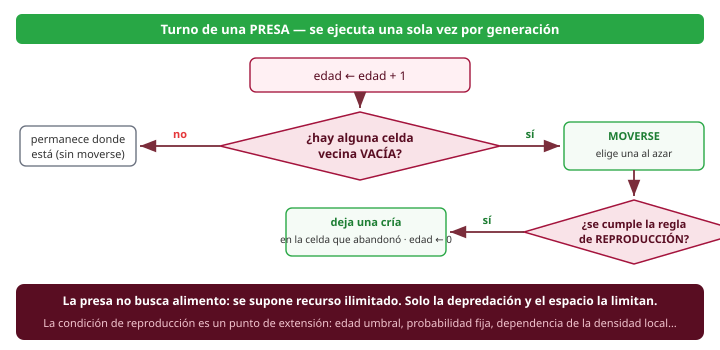

<!--
Señale el recuadro inferior: la condición de reproducción está deliberadamente sin especificar. En la parte V la convertimos en un parámetro del modelo.
-->

---

# Reglas del depredador

El depredador administra además una reserva de **energía**:

1. **Envejecer:** su edad aumenta en uno.
2. **Comer:** si hay una presa en su vecindario, se mueve a esa celda y la consume; su energía aumenta.
3. **Moverse:** si no hay presas cerca, se desplaza a una celda vacía y pierde una unidad de energía.
4. **Reproducirse:** si se cumple la condición de reproducción, deja una cría.
5. **Morir:** si se cumple la condición de muerte, desaparece y la celda queda vacía.

<!--
El orden de los pasos 4 y 5 no es inocuo: si evalúa la muerte antes que la reproducción, un depredador agotado no deja descendencia; si la evalúa después, sí. Ambas versiones son defendibles, y producen dinámicas medibles distintas. Pídales que elijan una, la justifiquen, y prueben la otra como experimento.
-->

---

# Reglas del depredador (diagrama)

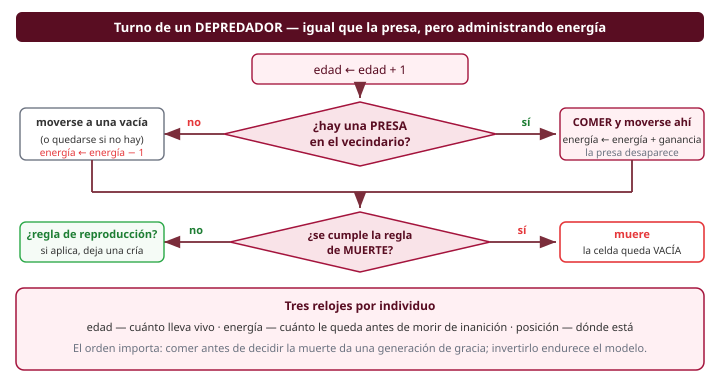

<!--
Los "tres relojes" del recuadro inferior son la estructura de datos mínima por individuo. Si alguien quiere añadir atributos (sexo, tamaño, memoria del terreno), este es el lugar donde entran, y el motor no debería enterarse.
-->

---

# Actualización síncrona o asíncrona

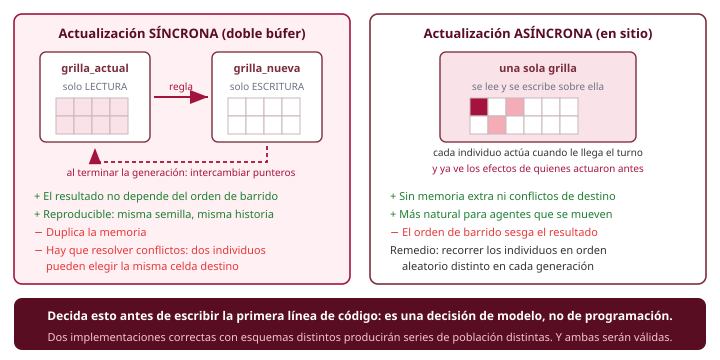

<!--
Esta es probablemente la lámina más importante de la sesión desde el punto de vista de la ingeniería.
Con agentes que se mueven, el esquema síncrono puro obliga a resolver colisiones: dos presas que eligen la misma celda destino. Las soluciones habituales son la prioridad por orden aleatorio o el sorteo entre los candidatos.
El esquema asíncrono con orden barajado es más simple de implementar correctamente y es el que sugiero para la primera versión; menciónelo así.
-->

---

# El algoritmo

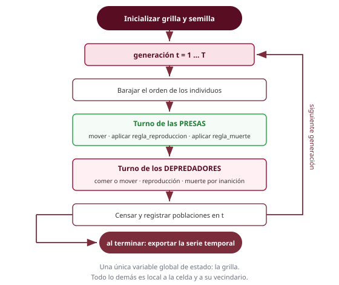

<!--
Fíjese en el primer bloque tras el inicio del bucle: barajar el orden. Si lo omiten, los individuos de las primeras filas siempre actuarán primero y se producirá un sesgo espacial visible como un gradiente en la grilla. Es un error clásico y muy difícil de detectar si no se sabe que existe.
-->

---

# Pseudocódigo — bucle principal

```
inicializar_grilla(N, M, n_presas, n_depredadores, semilla)

para t = 1 hasta T:

    individuos ← recolectar_individuos(grilla)
    barajar(individuos)

    para cada individuo a en individuos:
        si ya_no_existe(a): continuar          # fue devorado este turno
        a.edad ← a.edad + 1
        turno(a)                                # despacha según la especie

    registrar(t, contar(PRESA), contar(DEPREDADOR))

exportar_series_temporales()
```

<!--
"ya_no_existe" es la trampa número uno de la implementación: una presa puede ser devorada por un depredador que actuó antes que ella en el mismo turno. Si no se verifica, se actualizan individuos fantasma.
La semilla explícita es un requisito del ejercicio: sin ella no hay reproducibilidad y el informe no es verificable.
-->

---

# Pseudocódigo — turno de la presa

```
función turno_presa(p):

    vacías ← vecinas_vacías(p.posición)
    origen ← p.posición

    si vacías ≠ ∅:
        mover(p, elegir_al_azar(vacías))

        si regla_reproducción[PRESA](p):
            colocar(PRESA, origen)              # nace la cría
            p.edad ← 0

    si regla_muerte[PRESA](p):
        eliminar(p)
```

<!--
Note que la muerte de la presa también está contemplada, aunque en el modelo básico su regla sea "nunca muere de forma natural". Dejar el gancho puesto desde el principio es lo que permite después probar variantes sin tocar esta función.
-->

---

# Pseudocódigo — turno del depredador

```
función turno_depredador(d):

    presas ← vecinas_con_presa(d.posición)
    origen ← d.posición

    si presas ≠ ∅:
        objetivo ← elegir_al_azar(presas)
        eliminar(individuo_en(objetivo))        # se lo come
        mover(d, objetivo)
        d.energía ← regla_alimentación(d)
    sino:
        vacías ← vecinas_vacías(d.posición)
        si vacías ≠ ∅: mover(d, elegir_al_azar(vacías))
        d.energía ← d.energía − 1

    si regla_muerte[DEPREDADOR](d):
        eliminar(d)
    sino si regla_reproducción[DEPREDADOR](d) y origen está vacío:
        colocar(DEPREDADOR, origen)
        d.edad ← 0
```

<!--
Todo el pseudocódigo de estas tres láminas es independiente del lenguaje a propósito. No quiero que copien código: quiero que traduzcan un algoritmo.
Observe que las cuatro reglas aparecen como funciones invocadas, nunca como condiciones escritas en línea. Ese es el punto que desarrolla la parte siguiente.
-->

---

# Parámetros del modelo

| Parámetro | Papel en la dinámica |
|---|---|
| Tamaño de grilla `N × M` | Espacio disponible y capacidad de carga |
| Densidad inicial de presas | Punto de partida del ciclo |
| Densidad inicial de depredadores | Presión inicial sobre la presa |
| Umbral de reproducción de la presa | Análogo de α |
| Umbral de reproducción del depredador | Análogo de δ |
| Energía ganada al comer | Eficiencia de conversión |
| Umbral de inanición | Análogo de γ |

El balance entre ellos decide si el sistema **oscila**, si una especie **se extingue** o si alcanza un **equilibrio ruidoso**.

<!--
Sugiérales pensar en términos de razones, no de valores absolutos: lo que importa es cuánto tarda un depredador en morir de hambre comparado con cuánto tarda una presa en reproducirse.
-->

---

<!-- _class: seccion -->

# Parte V
## Reglas configurables

---

# Separe el motor de las reglas

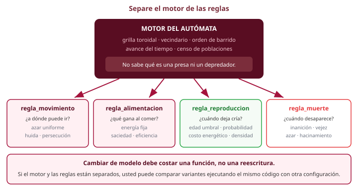

<!--
Este es el requisito de diseño central del ejercicio. No basta con que la simulación funcione: debe poder cambiarse de modelo sin reescribirla.
Analogía útil para el grupo: el motor es el intérprete, las reglas son el programa. Un intérprete que hay que recompilar para cada programa no sirve de mucho.
-->

---

# Las cuatro reglas como puntos de extensión

El motor no debería contener ni una sola condición del tipo `si edad ≥ 3`. Todas esas decisiones viven en funciones intercambiables:

| Regla | Firma conceptual | Devuelve |
|---|---|---|
| `regla_movimiento` | (individuo, vecindario) | celda destino o ninguna |
| `regla_alimentación` | (individuo) | nueva energía |
| `regla_reproducción` | (individuo) | verdadero / falso |
| `regla_muerte` | (individuo) | verdadero / falso |

Cada especie tiene su propio juego de reglas.

<!--
Si trabajan en un lenguaje con punteros a función o funciones de primera clase, esto es directo. Si no, una enumeración más un despacho con un condicional dentro de la función de regla (nunca en el motor) es perfectamente aceptable.
Lo que se evalúa es la separación, no el mecanismo.
-->

---

# Variantes de la regla de reproducción

| Variante | Condición | Efecto esperado |
|---|---|---|
| **Por edad** (básica) | `edad ≥ umbral` | Ciclos regulares, fácil de calibrar |
| **Probabilística** | con probabilidad `p` en cada turno | Suaviza los picos, elimina la sincronía de cohortes |
| **Con costo energético** | `energía ≥ mínimo`, y se reparte con la cría | Acopla natalidad y alimento |
| **Dependiente de densidad** | solo si hay menos de `k` congéneres vecinos | Introduce competencia intraespecífica |
| **Sexual** | requiere un congénere vecino | Hace frágiles las poblaciones pequeñas |

<!--
La variante probabilística merece un comentario: con la regla por edad, todos los individuos nacidos en el mismo turno se reproducen en el mismo turno, y aparecen cohortes sincronizadas que amplifican las oscilaciones de forma artificial. La probabilidad rompe esa sincronía.
La variante sexual es la que produce el fenómeno más interesante: por debajo de cierta densidad, la población colapsa aunque haya alimento de sobra (efecto Allee).
-->

---

# Variantes de la regla de muerte

| Variante | Condición | Efecto esperado |
|---|---|---|
| **Por inanición** (básica) | `energía ≤ 0` | Regula al depredador, no a la presa |
| **Por vejez** | `edad ≥ vida_máxima` | Impone renovación, evita individuos eternos |
| **Probabilística** | con probabilidad `q` en cada turno | Mortalidad de fondo, más realista |
| **Por hacinamiento** | más de `k` vecinos ocupados | Capacidad de carga local, no global |
| **Por inanición gradual** | `energía` cae más rápido si no come varias veces | Endurece el castigo a la mala racha |

<!--
La mortalidad por vejez en la presa es lo que más cambia el sistema: sin ella, una presa acorralada en una región sin depredadores vive indefinidamente, y aparecen "reservas" estables que no se ven en la naturaleza.
La muerte por hacinamiento es interesante porque es la única de la lista que depende del vecindario, no del individuo: obliga a pasar el vecindario a la función de regla.
-->

---

# Pseudocódigo — configuración del modelo

```
configuración ← {
    vecindario:        VON_NEUMANN,
    actualización:     ASÍNCRONA_ORDEN_ALEATORIO,

    PRESA: {
        movimiento:    aleatorio_a_vecina_vacía,
        reproducción:  por_edad(umbral = 3),
        muerte:        nunca
    },

    DEPREDADOR: {
        movimiento:    aleatorio_a_vecina_vacía,
        alimentación:  energía_fija(ganancia = 4),
        reproducción:  por_edad(umbral = 10),
        muerte:        por_inanición
    }
}
```

<!--
Insista en que esto no es un archivo de configuración obligatorio: puede ser una estructura en memoria, un conjunto de punteros a función, o un archivo de texto leído al arrancar. Lo que importa es que exista un único lugar donde se declare el modelo.
Un beneficio inmediato: el informe puede citar el bloque de configuración de cada experimento, y eso hace los resultados reproducibles.
-->

---

# Pseudocódigo — reglas intercambiables

```
# ── Reproducción ──────────────────────────────────────────
función por_edad(umbral)(a):
    devolver a.edad ≥ umbral

función probabilística(p)(a):
    devolver azar_uniforme(0,1) < p

función con_costo(umbral, costo)(a):
    si a.energía ≥ umbral:
        a.energía ← a.energía − costo       # la cría hereda el costo
        devolver verdadero
    devolver falso

# ── Muerte ────────────────────────────────────────────────
función por_inanición(a):        devolver a.energía ≤ 0
función por_vejez(máx)(a):       devolver a.edad ≥ máx
función mixta(máx)(a):           devolver a.energía ≤ 0 o a.edad ≥ máx
```

<!--
La notación función(parámetros)(individuo) representa una función que devuelve otra función ya configurada: un cierre, si el lenguaje lo permite, o una estructura con parámetros más un puntero a función si no.
Si el grupo trabaja en C, este es un buen momento para hablar de punteros a función y de structs de configuración; es un patrón que van a reencontrar toda su vida profesional.
-->

---

# Qué observar al cambiar una regla

Cada variante debe evaluarse con las mismas métricas:

- **Amplitud y periodo** de las oscilaciones
- **Desfase** entre los picos de ambas especies
- **Frecuencia de extinción** en un número dado de corridas
- **Distribución espacial**: ¿grupos, frentes de onda, mezcla uniforme?
- **Sensibilidad a la semilla**: ¿cuánto varía entre corridas idénticas?

> Una regla no es "mejor" que otra. Es más o menos adecuada a la pregunta que usted quiere responder.

<!--
El punto sobre la distribución espacial es el que suele sorprenderlos: en el modelo espacial aparecen frentes de onda, espirales y refugios que el modelo continuo no puede producir de ninguna manera. Vale la pena que grafiquen la grilla, no solo las curvas.
-->

---

# Resultados típicos y diagnóstico

Con parámetros balanceados, el modelo reproduce cualitativamente lo que predice Lotka-Volterra: oscilaciones desfasadas, pero **irregulares**, porque el sistema es discreto, espacial y estocástico.

Cuando algo va mal, casi siempre es uno de estos casos:

- El umbral de inanición es muy bajo → los depredadores se extinguen → las presas saturan la grilla
- El umbral de reproducción de la presa es muy alto → se extinguen ambas especies
- La reproducción del depredador es muy rápida → colapso en las primeras generaciones
- Las poblaciones no oscilan sino que se estabilizan → revise si está barajando el orden de los individuos

<!--
El cuarto síntoma es el más instructivo: un sistema demasiado ordenado (barrido siempre en el mismo sentido) puede producir un régimen estacionario artificial. Es una buena oportunidad para hablar de artefactos de simulación.
-->

---

<!-- _class: seccion -->

# Parte VI
## Ejercicio propuesto

---

# Ejercicio: simulación depredador–presa

**Objetivo:** implementar una simulación depredador–presa sobre un autómata celular, **en versión secuencial**, con reglas configurables.

**Requisitos funcionales**

- Grilla toroidal de `N × M`, con vecindario seleccionable
- Presas y depredadores con los atributos descritos
- Motor independiente de las reglas: cambiar de modelo no debe exigir tocar el bucle principal
- Al menos **dos variantes de reproducción** y **dos de muerte**, seleccionables por configuración
- Registro de poblaciones en cada generación y semilla explícita

<!--
Recalque que la calificación pesa más sobre la separación motor/reglas que sobre la simulación en sí. Una simulación correcta pero monolítica no cumple el objetivo del taller.
Anuncie aquí que la versión paralela de este mismo programa será el taller siguiente, y que quien construya bien el motor ahora tendrá mucho menos trabajo entonces.
-->

---

# Parámetros sugeridos para empezar

| Parámetro | Valor sugerido |
|---|---|
| Grilla | 500 × 500 |
| Presas iniciales | 50 000 |
| Depredadores iniciales | 5 000 |
| Umbral de reproducción de la presa | 3 generaciones |
| Umbral de reproducción del depredador | 10 generaciones |
| Energía ganada al comer | 4 unidades |
| Energía inicial del depredador | 4 unidades |
| Generaciones totales | 1 000 |

Son un punto de partida, no una receta: se espera que usted los mueva.

<!--
Con estos valores el sistema oscila de forma razonable en la mayoría de las semillas, pero no en todas: es normal y conviene advertirlo para que no crean que su implementación falla.
-->

---

# Experimentos requeridos

1. **Caso base:** las curvas de población durante 1 000 generaciones, con tres semillas distintas.
2. **Barrido de un parámetro:** elija uno y muestre cómo cambia la dinámica al variarlo en al menos cinco valores.
3. **Comparación de reglas:** misma configuración, misma semilla, cambiando únicamente la regla de reproducción o la de muerte.
4. **Vecindario:** el caso base con Von Neumann y con Moore.

Cada experimento debe acompañarse de la gráfica correspondiente y de una interpretación de dos o tres frases.

<!--
El experimento 3 es el que verifica que la arquitectura es correcta: si para cambiar la regla tuvieron que modificar el motor, el diseño no cumplió el requisito.
Sugiera que usen la misma semilla en el experimento 3 para que la comparación sea limpia.
-->

---

# Entregables

1. **Código fuente** comentado, con instrucciones de compilación y ejecución
2. **Archivo o bloque de configuración** de cada experimento
3. **Gráficas de población** (presas y depredadores frente al tiempo)
4. **Instantáneas de la grilla** en al menos tres momentos representativos
5. **Informe breve** (máximo 3 páginas):
   - Decisiones de modelado y su justificación
   - Descripción de las reglas implementadas
   - Resultados de los cuatro experimentos y su interpretación
   - Limitaciones observadas del modelo

<!--
Las instantáneas de la grilla son un entregable nuevo y deliberado: obligan a mirar el espacio, que es justamente lo que distingue este modelo del de Lotka-Volterra.
Un PGM o un PPM en texto plano basta; no hace falta ninguna biblioteca gráfica.
-->

---

# Recomendaciones de implementación

- Empiece con una grilla pequeña (por ejemplo 20 × 20) y **imprima la grilla en texto** hasta que las reglas sean correctas
- Fije la semilla desde el primer día: sin reproducibilidad no hay depuración posible
- Verifique la aritmética modular de la frontera antes que ninguna otra cosa
- Cuide el caso del individuo devorado en el mismo turno en que le tocaba actuar
- Separe desde el principio: motor, reglas, entrada/salida y estadísticas

<!--
El consejo de la grilla pequeña con salida en texto es el que más tiempo les ahorra y el que más ignoran. Insista.
El cuarto punto es el error de programación más frecuente en este ejercicio; si les da la pista aquí, la mitad del grupo se la ahorra.
-->

---

# Referencias

- Gardner, M. "The fantastic combinations of John Conway's new solitaire game 'Life'." *Scientific American*, 223(4), octubre 1970.
- Wolfram, S. *A New Kind of Science*. Wolfram Media, 2002.
- Toffoli, T. y Margolus, N. *Cellular Automata Machines: A New Environment for Modeling*. MIT Press, 1987.
- Chopard, B. y Droz, M. *Cellular Automata Modeling of Physical Systems*. Cambridge University Press, 1998.
- Ermentrout, G.B. y Edelstein-Keshet, L. "Cellular automata approaches to biological modeling." *Journal of Theoretical Biology*, 160(1), 1993.
- Lotka, A.J. *Elements of Physical Biology*. Williams & Wilkins, 1925.
- Volterra, V. "Variazioni e fluttuazioni del numero d'individui in specie animali conviventi." *Mem. Acad. Lincei*, 1926.

<!--
El artículo de Ermentrout y Edelstein-Keshet es la mejor entrada para quien quiera profundizar en modelos de AC aplicados a biología, y es accesible para estudiantes de pregrado.
-->

---

<!-- _class: portada -->
<!-- _paginate: false -->
<!-- _header: "" -->
<!-- _footer: "" -->

# ¿Preguntas?

### Próximo taller: paralelización de la simulación

<!--
Cierre anunciando explícitamente la continuidad: el mismo programa, la misma grilla, las mismas reglas, pero repartiendo el trabajo. Quien haya separado bien el motor de las reglas partirá con ventaja.
-->
