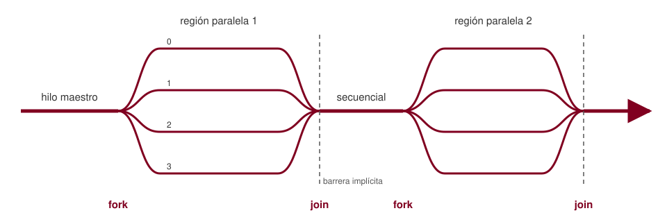

<!-- _class: lead -->
<!-- _paginate: false -->

# Introducción a OpenMP

## Programación paralela en memoria compartida

Programación Paralela · Escuela de Ingeniería de Sistemas e Informática · UIS

---

## Agenda

1. Memoria compartida y el porqué de OpenMP
2. Modelo de ejecución *fork-join*
3. Compilación y primer programa
4. La región `parallel`
5. Reparto de trabajo con `for`
6. Condiciones de carrera
7. La cláusula `reduction`
8. Caso de estudio: cálculo de π
9. Medición de tiempo y *speedup*

---

## Arquitectura de memoria compartida

- Varios **núcleos** acceden a un **único espacio de direcciones**
- Los hilos de un mismo proceso **comparten** variables globales y el *heap*
- Cada hilo tiene su **propia pila** (variables locales, registros)
- La comunicación entre hilos se hace **leyendo y escribiendo memoria**

> Ventaja: no hay que enviar mensajes explícitos (a diferencia de MPI).
> Riesgo: dos hilos pueden modificar el mismo dato al mismo tiempo.

---

## ¿Qué es OpenMP?

- **API estándar** para paralelismo en memoria compartida: C, C++ y Fortran
- Mantenida por el *OpenMP Architecture Review Board* (especificación actual: 6.0)
- Tres componentes:
  - **Directivas** del compilador: `#pragma omp ...`
  - **Rutinas** de biblioteca: `omp_get_thread_num()`, `omp_get_wtime()`...
  - **Variables de entorno**: `OMP_NUM_THREADS`, `OMP_SCHEDULE`...
- Paralelización **incremental**: se parte del código secuencial y se anotan las zonas costosas

---

## Pthreads vs. OpenMP

| | Pthreads | OpenMP |
|---|---|---|
| Nivel | Bajo | Alto |
| Creación de hilos | Explícita (`pthread_create`) | Implícita (directiva) |
| Reparto del trabajo | Manual | Automático (`for`) |
| Código secuencial | Se reestructura | Se conserva |
| Control fino | Total | Limitado |

<p class="nota">Si el compilador ignora los <code>#pragma</code>, el programa OpenMP sigue siendo un programa secuencial válido.</p>

---

## Modelo de ejecución *fork-join*



- El programa arranca con un solo hilo: el **hilo maestro** (id 0)
- **Fork**: al entrar en una región paralela se crea un equipo de hilos
- **Join**: al salir hay una **barrera implícita**; continúa solo el maestro

---

## Compilación y ejecución

```bash
# GCC / Clang
gcc -fopenmp -O2 programa.c -o programa

# Elegir el número de hilos
export OMP_NUM_THREADS=4
./programa

# O solo para una ejecución
OMP_NUM_THREADS=8 ./programa
```

- Sin `-fopenmp`, las directivas se **ignoran** (el código compila en secuencial)
- Cabecera para las rutinas de biblioteca: `#include <omp.h>`

---

## Primer programa: *Hola mundo*

```c
#include <stdio.h>
#include <omp.h>

int main(void) {
    #pragma omp parallel
    {
        int id  = omp_get_thread_num();   // identificador del hilo
        int nth = omp_get_num_threads();  // tamaño del equipo
        printf("Hola desde el hilo %d de %d\n", id, nth);
    }
    return 0;
}
```

- El bloque `{ ... }` lo ejecutan **todos** los hilos del equipo
- `id` y `nth` son **privadas**: se declaran dentro de la región

---

## Salida: el orden no está garantizado

```text
$ OMP_NUM_THREADS=4 ./hola
Hola desde el hilo 2 de 4
Hola desde el hilo 0 de 4
Hola desde el hilo 3 de 4
Hola desde el hilo 1 de 4
```

- El **planificador del sistema operativo** decide qué hilo avanza primero
- Cada ejecución puede producir un orden distinto
- **Lección**: nunca suponer un orden de ejecución entre hilos

---

## Controlar el número de hilos

Tres mecanismos, de **menor a mayor prioridad**:

```bash
export OMP_NUM_THREADS=4            # 1. variable de entorno
```
```c
omp_set_num_threads(6);             // 2. rutina en tiempo de ejecución

#pragma omp parallel num_threads(8) // 3. cláusula en la directiva
{ ... }
```

- Rutinas útiles: `omp_get_max_threads()`, `omp_get_num_procs()`

---

## Paralelismo manual: repartir un bucle a mano

```c
#pragma omp parallel
{
    int id  = omp_get_thread_num();
    int nth = omp_get_num_threads();
    int ini = id * N / nth;
    int fin = (id + 1) * N / nth;
    for (int i = ini; i < fin; i++)
        c[i] = a[i] + b[i];
}
```

- Funciona, pero es **tedioso** y propenso a errores de índices
- OpenMP ofrece una construcción que hace esto automáticamente...

---

## Reparto de trabajo: `omp for`

```c
#pragma omp parallel
{
    #pragma omp for
    for (int i = 0; i < N; i++)
        c[i] = a[i] + b[i];
}
```

Forma combinada (la más común):

```c
#pragma omp parallel for
for (int i = 0; i < N; i++)
    c[i] = a[i] + b[i];
```

- Las **iteraciones** se reparten entre los hilos del equipo
- La variable del bucle `i` es **privada** automáticamente
- Barrera implícita al final del `for`

---

## Requisitos del bucle

El bucle debe tener **forma canónica**: el número de iteraciones se conoce al entrar.

```c
for (init; var relop limite; incremento)
```

- Si:  `for (i = 0; i < n; i++)`, `for (i = n-1; i >= 0; i -= 2)`
- No: Bucles `while` o con `break` hacia fuera del bucle
- No: Modificar `i` o `n` dentro del cuerpo

> Además, las iteraciones deben ser **independientes**: ninguna debe depender del resultado de otra.

---

## Dependencias entre iteraciones

```c
// Independientes: se puede paralelizar
for (i = 0; i < n; i++)
    a[i] = b[i] * 2.0;

// Dependencia de flujo: a[i] necesita a[i-1]
for (i = 1; i < n; i++)
    a[i] = a[i-1] + b[i];
```

- OpenMP **no verifica** las dependencias: si se paraleliza el segundo bucle, compila y ejecuta, pero el resultado es **incorrecto**
- La responsabilidad es del programador

---

## Una suma paralela... ¿correcta?

```c
double suma = 0.0;

#pragma omp parallel for
for (int i = 0; i < N; i++)
    suma += a[i];

printf("Suma = %f\n", suma);
```

- `suma` es **compartida** por todos los hilos
- Ejecute varias veces: el resultado **cambia** y suele ser menor que el esperado

---

## Condición de carrera

`suma += a[i]` no es una operación atómica, son **tres pasos**:

| Tiempo | Hilo 0 | Hilo 1 | `suma` en memoria |
|---|---|---|---|
| t1 | lee `suma` (10) | | 10 |
| t2 | | lee `suma` (10) | 10 |
| t3 | calcula 10 + 3 | calcula 10 + 5 | 10 |
| t4 | escribe 13 | | 13 |
| t5 | | escribe 15 | **15** ← se perdió el +3 |

**Condición de carrera**: el resultado depende del orden relativo de los accesos a un dato compartido, y al menos uno de ellos es una escritura.

---

## La cláusula `reduction`

```c
double suma = 0.0;

#pragma omp parallel for reduction(+:suma)
for (int i = 0; i < N; i++)
    suma += a[i];
```

1. Cada hilo recibe una **copia privada** de `suma`, inicializada con el neutro del operador (0 para `+`)
2. Cada hilo acumula en su copia **sin interferencias**
3. Al final, las copias se **combinan** con el valor original de `suma`

---

## Operadores de reducción

| Operador | Valor inicial de la copia privada |
|---|---|
| `+` | 0 |
| `*` | 1 |
| `&&` | 1 (verdadero) |
| `\|\|` | 0 (falso) |
| `&`, `\|`, `^` | todos los bits en 1 / 0 / 0 |
| `max` | menor valor representable |
| `min` | mayor valor representable |

```c
#pragma omp parallel for reduction(max:mayor) reduction(+:suma)
```

<p class="nota">Con punto flotante, el orden de la suma cambia: puede haber diferencias en los últimos dígitos respecto a la versión secuencial.</p>

---

## Caso de estudio: aproximar π

$$\pi = \int_0^1 \frac{4}{1+x^2}\,dx \approx \Delta x \sum_{i=0}^{N-1} \frac{4}{1+x_i^2}, \qquad x_i = (i + 0.5)\,\Delta x$$

- Regla del punto medio con $N$ rectángulos de ancho $\Delta x = 1/N$
- Cada rectángulo se calcula de forma **independiente**
- Solo hay que **acumular** los resultados → patrón de reducción

---

## π: versión secuencial

```c
#include <stdio.h>

int main(void) {
    const long N = 100000000;
    const double dx = 1.0 / N;
    double suma = 0.0;

    for (long i = 0; i < N; i++) {
        double x = (i + 0.5) * dx;
        suma += 4.0 / (1.0 + x * x);
    }

    printf("pi ~ %.12f\n", suma * dx);
    return 0;
}
```

---

## π: versión OpenMP

```c
#include <stdio.h>
#include <omp.h>

int main(void) {
    const long N = 100000000;
    const double dx = 1.0 / N;
    double suma = 0.0;

    #pragma omp parallel for reduction(+:suma)
    for (long i = 0; i < N; i++) {
        double x = (i + 0.5) * dx;   // privada: declarada en el cuerpo
        suma += 4.0 / (1.0 + x * x);
    }

    printf("pi ~ %.12f\n", suma * dx);
    return 0;
}
```

**Un solo `#pragma`** separa ambas versiones.

---

## Medir el tiempo: `omp_get_wtime()`

```c
double t0 = omp_get_wtime();

#pragma omp parallel for reduction(+:suma)
for (long i = 0; i < N; i++) { ... }

double t1 = omp_get_wtime();
printf("Tiempo: %.4f s con %d hilos\n", t1 - t0, omp_get_max_threads());
```

- Devuelve el **tiempo de pared** (*wall-clock*) en segundos
- No usar `clock()`: mide tiempo de CPU **acumulado** de todos los hilos

---

## *Speedup* y eficiencia

$$S(p) = \frac{T_1}{T_p} \qquad\qquad E(p) = \frac{S(p)}{p}$$

```bash
for p in 1 2 4 8 16; do
    OMP_NUM_THREADS=$p ./pi
done
```

- Repetir cada medición varias veces y reportar la **mediana**
- Comparar contra el número de **núcleos físicos** disponibles (`lscpu`)
- El *speedup* ideal es lineal; en la práctica lo limitan la fracción secuencial (Amdahl), la creación de hilos y el ancho de banda de memoria

---

## Errores frecuentes

- Olvidar `-fopenmp`: compila sin avisos, pero corre en **un solo hilo**
- Paralelizar un bucle con **dependencias** entre iteraciones
- Acumular en una variable compartida **sin** `reduction`
- Declarar temporales **fuera** de la región paralela (quedan compartidas)
- Paralelizar bucles con **muy poco trabajo**: el costo del *fork-join* supera la ganancia
- Usar `clock()` para medir tiempos paralelos

---

## Resumen

| Construcción | Función |
|---|---|
| `#pragma omp parallel` | Crea un equipo de hilos (*fork*) |
| `#pragma omp for` | Reparte iteraciones entre los hilos |
| `#pragma omp parallel for` | Forma combinada de ambas |
| `reduction(op:var)` | Acumulación segura sin carreras |
| `omp_get_thread_num()` | Identificador del hilo |
| `omp_get_num_threads()` | Tamaño del equipo |
| `omp_get_wtime()` | Tiempo de pared |
| `OMP_NUM_THREADS` | Número de hilos por defecto |

---

## Ejercicios propuestos

1. Compile *Hola mundo* con y sin `-fopenmp`, y explique la diferencia en la salida
2. Paralelice el producto punto de dos vectores de $10^8$ elementos
3. Encuentre el **máximo** y el **mínimo** de un arreglo con una sola región paralela
4. Mida el *speedup* y la eficiencia del cálculo de π para $p = 1, 2, 4, 8$ y grafique los resultados
5. Identifique cuáles de estos bucles se pueden paralelizar y justifique:
   `a[i] = a[i+1] + 1;` · `a[i] = b[i] + c[i-1];` · `a[i] = a[i] * 2;`

---

<!-- _class: lead -->
<!-- _paginate: false -->

# Próxima sesión

## Ámbito de datos y sincronización

`private` · `shared` · `firstprivate` · `critical` · `atomic` · `barrier`
